# [設定] 旅遊資訊
> 座標: N/A
> 地址: N/A
> 開始日期: 2026-04-18
> 總天數: 9
> day1_Order: 多美迎 PREMIUM 博多運河城前飯店（Dormy Inn Premium Hakata Canal City Mae）, 肉の山翔（Niku no Yamasho）, 宮地嶽神社（Miyajidake Shrine / 宮地嶽神社）, 博多水炊き専門 橙, 福岡城跡（福岡城 / Fukuoka Castle Ruins）
> day2_Order: 桜井二見ヶ浦 夫婦岩（Sakurai Futamigaura / 夫婦岩）, 櫻井神社（桜井神社 / Sakurai Shrine）, 手工花鹽布丁（またいちの塩 製塩所 工房とったん / Mataichi no Shio Tottan）, かわ屋 祇園店（Kawaya Gion）
> day3_Order: 堀越耕平《僕のヒーローアカデミア／我的英雄學院》原畫展（福岡會場）, 太宰府天滿宮（Dazaifu Tenmangu / 太宰府天満宮）, 太宰府表参道（太宰府天満宮 参道 / Dazaifu Omotesando）, 櫛田神社（Kushida Shrine）, 博多もつ鍋前田屋 博多店

# [整理] 熊本 3 日精選（IG Reel 整理）
> 連結: N/A

### 備註
- 熊本市區可步行/路面電車串連（熊本城→城下町），再延伸 1 小時車程到阿蘇火山群自駕最順。
- 必訪清單 櫻の馬場／熊本城／阿蘇火口／草千里／米塚
#### 其他
- 其他連結：
  - 來源連結：https://www.instagram.com/reel/DUK4Rk7El-V/
---
# [景點] 櫻の馬場 城彩苑（桜の馬場 城彩苑 / Sakura-no-baba Josaien）
> 座標: 32.803671, 130.703756
> 地址: 〒860-0008 熊本県熊本市中央区二の丸１−１−２
> 連結: https://www.google.com/maps/place/%E6%A1%9C%E3%81%AE%E9%A6%AC%E5%A0%B4+%E5%9F%8E%E5%BD%A9%E8%8B%91/@32.8036711,130.7037558,17z/data=!3m1!4b1!4m6!3m5!1s0x3540f412e6855555:0x3c2a243312aea32b!8m2!3d32.8036711!4d130.7037558!16s%2Fg%2F11bxc649vp?hl=ja

### 想做什麼
- 逛「城下町風」美食/伴手禮聚落
- 吃在地小吃：馬肉可樂餅、辛子蓮根等

### 備註
- 這裡本質是觀光型商店街，適合排在熊本城前後當午餐/點心站。
- 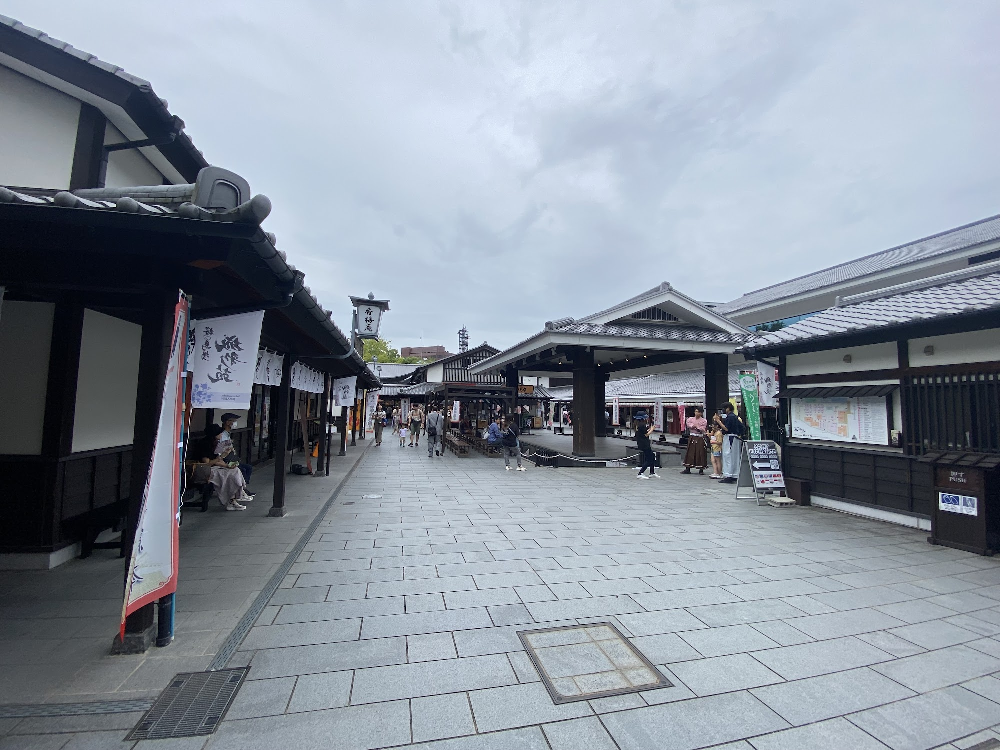

#### 其他
- 行政區：日本・熊本縣 熊本市（熊本城旁）
- 交通：
  - 市區可用路面電車＋步行到熊本城周邊；再步行過來很順。
- 預估停留時間：45–90 分鐘（吃＋逛）
- 優先度：想去
---
# [景點] 熊本城（Kumamoto Castle / 熊本城）
> 座標: 32.806186, 130.705834
> 地址: 〒860-0002 熊本県熊本市中央区本丸１−１
> 連結: https://www.google.com/maps/place/%E7%86%8A%E6%9C%AC%E5%9F%8E/@32.8061859,130.7058335,17z/data=!3m1!4b1!4m6!3m5!1s0x3540f40e023aca59:0x5e8b66c876cde430!8m2!3d32.8061859!4d130.7058335!16zL20vMDF4MWc1?hl=ja

### 想做什麼
- 參觀日本三大名城之一、看四百多年城史
- 上城俯瞰熊本市區

### 備註
- 以熊本城為核心發展的城下町結構，是理解熊本市區的起點。
- 

#### 其他
- 行政區：日本・熊本縣 熊本市
- 交通：
  - 市區：步行可串連多數點；路面電車也方便。
- 預估停留時間：90–150 分鐘（含園區散步＋拍照）
- 優先度：必去
---
# [景點] 阿蘇火口（阿蘇中岳火口 / Aso Nakadake Crater）
> 座標: 32.884907, 131.084934
> 地址: 〒869-2225 熊本県阿蘇市黒川
> 連結: https://www.google.com/maps/place/%E9%98%BF%E8%98%87%E4%B8%AD%E5%B2%B3+%E7%AC%AC1%E7%81%AB%E5%8F%A3/@32.884907,131.0801708,17z/data=!4m10!1m2!2m1!1z6Zi_6JiH5Lit5bKz54Gr5Y-j!3m6!1s0x3540d86157b2ad15:0x8e6c816a9f4528e8!8m2!3d32.884907!4d131.0849344!15sChLpmL_omIfkuK3lsrPngavlj6NaFiIU6Zi_6JiHIOS4reWysyDngavlj6OSARJ0b3VyaXN0X2F0dHJhY3Rpb27gAQA!16s%2Fg%2F1tgj6lt3?hl=ja

### 想做什麼
- 看世界級火山口地形（震撼、壯觀）

### 備註
- 火口常有「火山氣體/天候」管制，可能臨時封閉；行前要看公告。
- 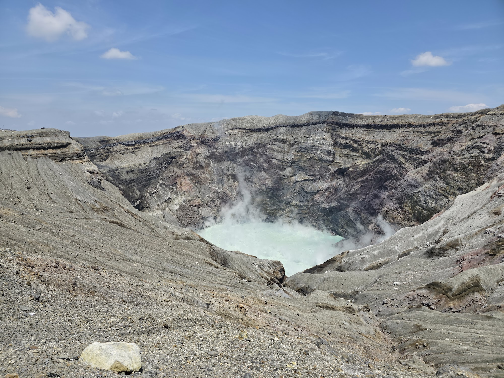

#### 其他
- 行政區：日本・熊本縣 阿蘇市／南阿蘇周邊（阿蘇火山群）
- 交通：
  - 建議自駕最有彈性（文內提到約 1 小時車程外）。
- 預估停留時間：60–120 分鐘（依是否能上火口、停車與步行距離）
- 優先度：想去
- 其他連結：
  - 火口管制/公告（官方入口，待你確認日期我再補最正確頁）：https://www.aso-volcano.jp/
---
# [景點] 草千里（Kusasenri-ga-hama / 草千里ヶ浜）
> 座標: 32.881825, 131.053328
> 地址: 〒869-1505 熊本県阿蘇市草千里ヶ浜
> 連結: https://www.google.com/maps/place/%E8%8D%89%E5%8D%83%E9%87%8C%E3%83%B6%E6%B5%9C/@32.8818249,131.0533279,17z/data=!3m1!4b1!4m6!3m5!1s0x354128aa1961ab5d:0xf8f3dcd6bdc48e4e!8m2!3d32.8818249!4d131.0533279!16s%2Fg%2F113k1jgcg?hl=ja

### 想做什麼
- 看遼闊草原景、拍明信片感風景
- 散步、看火山地形與視野

### 備註
- 跟火口同區域，通常可同日順遊。
- 

#### 其他
- 行政區：日本・熊本縣 阿蘇火山群周邊
- 交通：
  - 自駕最順；大眾運輸需看班次（之後你定住宿點我再細化）。
- 預估停留時間：45–90 分鐘
- 優先度：想去
---
# [景點] 米塚（Komezuka / 米塚）
> 座標: 32.905536, 131.044509
> 地址: 〒869-2226 熊本県阿蘇市乙姫
> 連結: https://www.google.com/maps/place/%E7%B1%B3%E5%A1%9A/@32.9055356,131.0445091,15z/data=!3m1!4b1!4m6!3m5!1s0x3540d8ae9fcaa2c9:0xd5dddfaf8128da43!8m2!3d32.9055361!4d131.0445091!16s%2Fg%2F1tc_tc2q?hl=ja

### 想做什麼
- 看「像飯糰一樣」的火山丘地形（拍照點）
- 自駕沿途景觀點（路上看也很舒服）

### 備註
- 多半是停留拍照的短點，適合插在阿蘇自駕路線上。
- 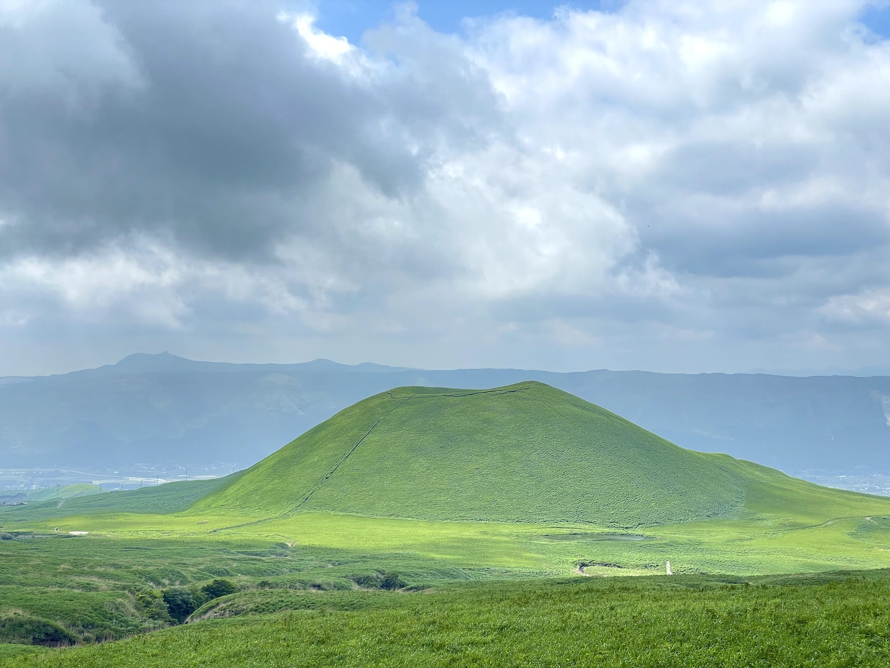

#### 其他
- 行政區：日本・熊本縣 阿蘇火山群周邊
- 交通：
  - 自駕。
- 預估停留時間：15–30 分鐘
- 優先度：可去
---
# [景點] 白川水源（Shirakawa Suigen / 白川水源）
> 座標: 32.825372, 131.095310
> 地址: 〒869-1502 熊本県阿蘇郡南阿蘇村白川２０４０
> 連結: https://www.google.com/maps/place/%E7%99%BD%E5%B7%9D%E6%B0%B4%E6%BA%90/@32.8253719,131.0953099,17z/data=!3m1!4b1!4m6!3m5!1s0x3540d966523871cd:0x113c62ca21333c9a!8m2!3d32.8253719!4d131.0953099!16s%2Fg%2F11fwgrlfjd?hl=ja

### 想做什麼
- 看湧水池、拍清澈水景
- 現場接水/喝名水（多數人會帶瓶子，依現場規定）

### 備註
- 位在「白川吉見神社」境內的湧水點。
- Wiki 記載：水溫約 14°C、湧出量約每分鐘 60 噸；1985 年入選「名水百選」。
- 屬「南阿蘇村湧水群」一帶，跟阿蘇自駕路線很常一起排。
- 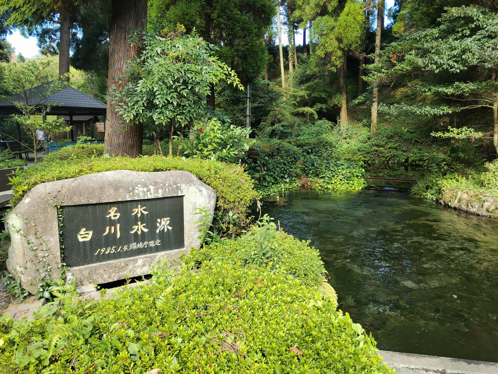

#### 其他
- 行政區：日本・熊本縣 阿蘇郡 南阿蘇村（阿蘇火山群周邊）
- 交通：
  - 建議自駕/包車最順；也可搭南阿蘇鐵道到「南阿蘇白川水源站」再轉步行/交通（依實際班次）。
- 預估停留時間：30–60 分鐘
- 優先度：想去
- 其他連結：
  - 參考（Wiki 日文，含數據）：https://ja.wikipedia.org/wiki/%E7%99%BD%E5%B7%9D_(%E7%86%8A%E6%9C%AC%E7%9C%8C)
---
# [景點] 堀越耕平《僕のヒーローアカデミア／我的英雄學院》原畫展（福岡會場）
> 座標: 33.588698, 130.399963
> 地址: 〒810-8544 福岡県福岡市中央区天神２丁目１−１
> 連結: https://www.google.com/maps/place/%E7%A6%8F%E5%B2%A1%E4%B8%89%E8%B6%8A/@33.588698,130.3999632,17z/data=!3m1!4b1!4m6!3m5!1s0x3541918feaf49173:0xbdd1ef5242007a7c!8m2!3d33.588698!4d130.3999632!16s%2Fg%2F120p9zpp?hl=ja
> Day: 3

### 想做什麼
看原畫展／買周邊／拍展場佈置/已訂票 4/20 10:00

### 備註
- 你提供的分段日程/售票：
- 展期A：2026/04/11–2026/05/10；售票：2026/02/14 起
- 展期B：2026/05/11–2026/06/14；售票：2026/04/29 起
- 官方頁面顯示總展期：2026/04/11–2026/06/14（每日 10:00–19:30；最後入場 19:00）。
- 具體「樓層/展場名稱」官方頁目前沒在可讀文字中直接標出：建議之後依售票頁/票券資訊再確認。
- 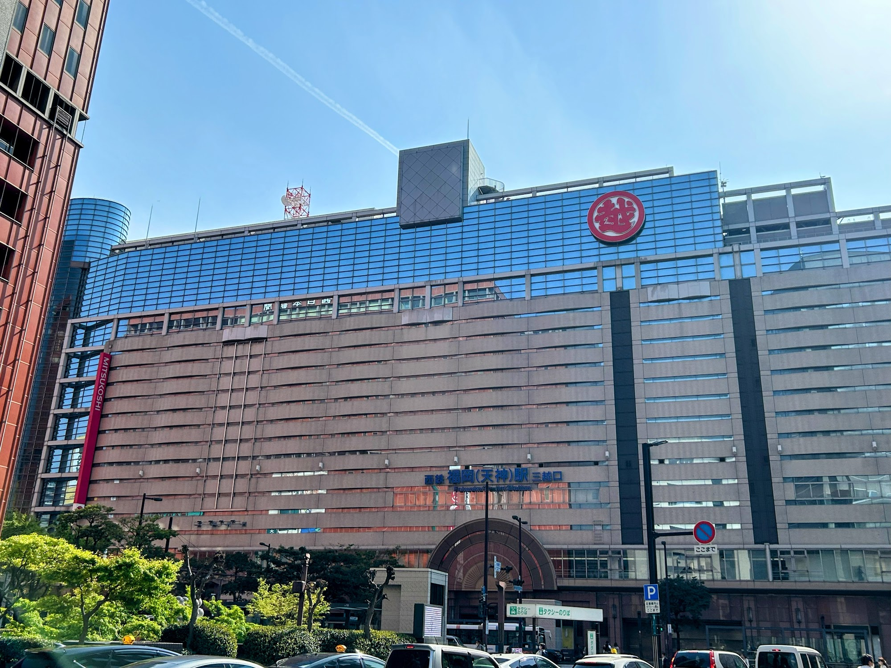

#### 其他
- 行政區：日本・福岡縣 福岡市中央區 天神
- 交通：
  - 地點：福岡三越（直通 西鐵福岡(天神)站／天神巴士中心）
  - 地鐵：天神站／天神南站可經天神地下街連通
- 預估停留時間：90–180 分鐘（看展＋排隊＋逛周邊）
- 優先度：想去
- 其他連結：
  - 福岡三越 活動頁（官方）：https://www.iwataya-mitsukoshi.mistore.jp/mitsukoshi/event_calendar/heroaca.html
  - 福岡三越 交通/地址（官方）：https://www.iwataya-mitsukoshi.mistore.jp/mitsukoshi/access.html
---
# [美食] 手工花鹽布丁（またいちの塩 製塩所 工房とったん / Mataichi no Shio Tottan）
> 座標: 33.577182, 130.089740
> 地址: 〒819-1335 福岡県糸島市志摩芥屋３７５７
> 連結: https://www.google.com/maps/place/%E3%81%BE%E3%81%9F%E3%81%84%E3%81%A1%E3%81%AE%E5%A1%A9+%E8%A3%BD%E5%A1%A9%E6%89%80+%E5%B7%A5%E6%88%BF%E3%81%A8%E3%81%A3%E3%81%9F%E3%82%93/@33.5771816,130.0897402,17z/data=!3m1!4b1!4m6!3m5!1s0x3541dd91e47fc8a5:0xee0b3d7e6c9f021e!8m2!3d33.5771816!4d130.0897402!16s%2Fg%2F1tk60x3_?hl=ja
> Day: 2

### 想做什麼
- 吃「塩をかけてたべるプリン」（鹽布丁/花鹽布丁）
- 看海景、吃點心/飲品（官網：薯條、咖啡、季節水果飲）
- 參觀製鹽作業（官網：可見學；團體建議事前預約）

### 備註
- 官網營業時間：10:00–17:00（年末年始休）
- 11–3 月週末（尤其 13:00–16:00）可能壅塞/混雜（牡蠣小屋旺季）。
- 專用停車場：土日祝日可能收費。
- 現場無廁所：需先解決或使用停車場旁公廁。
- 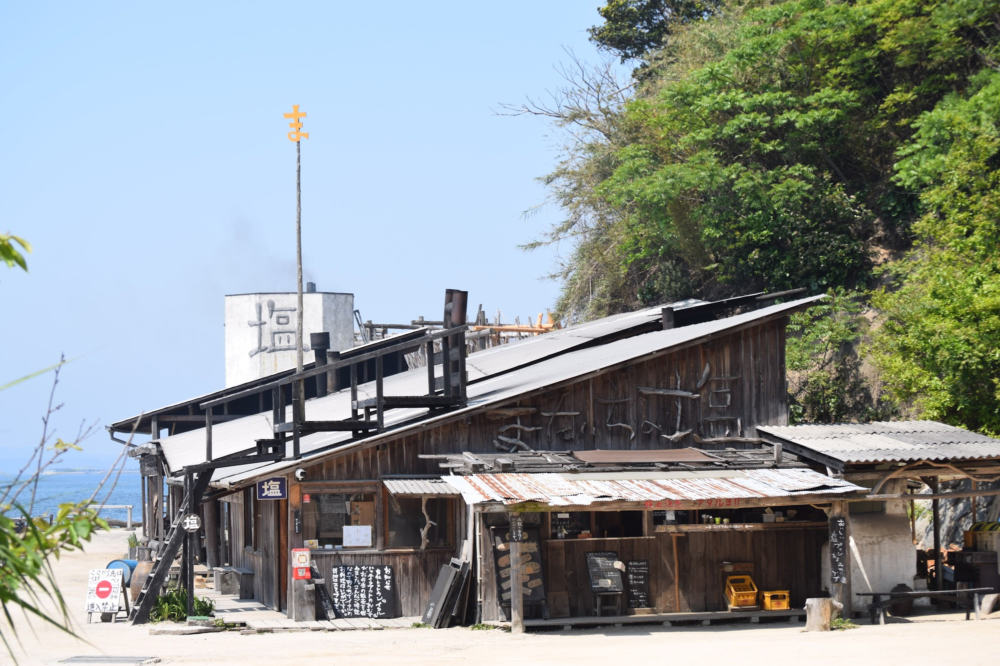

#### 其他
- 行政區：日本・福岡縣 糸島市（Itoshima）
- 交通：
  - 自駕：國道202→轉縣道54往芥屋→岐志漁港→沿海約 5km（官網指引）
  - 大眾運輸：JR 筑肥線「筑前前原」站北口，計程車約 25 分（官網指引）
- 預估停留時間：45–90 分鐘（吃布丁＋拍照看海；若加見學可再拉長）
- 優先度：想去
- 其他連結：
  - 官網（工房とったん）：https://mataichi.info/tottan/
---
# [景點] 太良嶽温泉 蟹御殿（Taradakeonsen Kanigoten）
> 座標: 32.957887, 130.205616
> 地址: 〒849-1615 佐賀県藤津郡太良町大浦乙３１６−３
> 連結: https://www.google.com/maps/place/%E5%A4%AA%E8%89%AF%E5%B6%BD%E6%B8%A9%E6%B3%89+%E8%9F%B9%E5%BE%A1%E6%AE%BF/@32.9578872,130.2056164,17z/data=!4m9!3m8!1s0x35403d9560c4afed:0x73b78032dd39a584!5m2!4m1!1i2!8m2!3d32.9578872!4d130.2056164!16s%2Fg%2F1thvdpy6?hl=ja

### 想做什麼
- 住海景溫泉旅館（你說房間可看海）
- 泡溫泉看海（官網描述可眺望有明海潮汐與雲仙方向景色）
- 吃竹崎蟹（官網主打在地竹崎蟹料理）

### 備註
- 官網：全館 16 間、全客房為套房；每間客房皆有半露天或露天風呂。
- 入住/退房（Google Maps）：Check-in 16:00／Check-out 10:00
- 評分（Google Maps）：約 4.4★（評論約 748）
- 

#### 其他
- 行政區：日本・佐賀縣 藤津郡 太良町（靠有明海）
- 交通：
  - JR 長崎本線「肥前大浦」站：車程約 5 分（官網：有免費接駁）
  - 自駕：長崎自動車道 武雄北方 IC 約 60 分（官網）
- 預估停留時間：至少 1 晚（建議 1–2 晚搭配太良町/有明海周邊）
- 優先度：想去
- 其他連結：
  - 官網：https://goten-resort.jp/kanigoten/

### 其他
- 電話：+81 954-68-2260
---
# [景點] 祐德稻荷神社（祐徳稲荷神社 / Yūtoku Inari Shrine）
> 座標: 33.073778, 130.107932
> 地址: 〒849-1321 佐賀県鹿島市古枝乙1855
> 連結: https://www.google.com/maps/place/%E7%A5%90%E5%BE%B3%E7%A8%B2%E8%8D%B7%E7%A5%9E%E7%A4%BE/@33.073778,130.1079317,17z/data=!3m1!4b1!4m6!3m5!1s0x354024f4600d2901:0x7e95f782245107b!8m2!3d33.073778!4d130.1079317!16s%2Fm%2F02q3vt5?hl=ja

### 想做什麼
- 參拜稻荷神（祈求商業繁盛、五穀豐收等）
- 拍「懸空高架」的華麗社殿（很有存在感）與朱色建築
- 走表參道吃逛＋買御守

### 備註
- Wiki 記載：創建 1687 年（貞享4年），別名「鎮西日光」。
- Google Maps 顯示 24 小時開放（實際授與所/參觀區域時間以官網為準）。
- 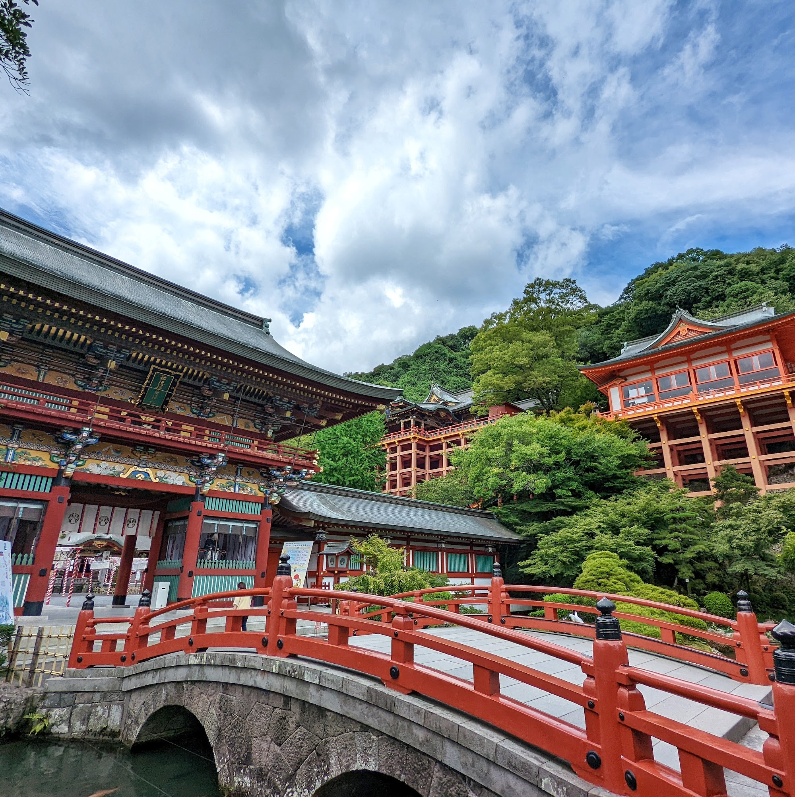

#### 其他
- 行政區：日本・佐賀縣 鹿島市
- 交通：
  - 從福岡出發常見可做佐賀一日遊路線的一站；若你確定起點（博多/天神/佐賀市/武雄溫泉），我再幫你補最順的大眾運輸/自駕時間。
- 預估停留時間：90–150 分鐘（含表參道吃逛可拉更長）
- 優先度：想去
- 其他連結：
  - IG（你提供）：https://www.instagram.com/reel/DR9T-0_AVdd/?igsh=MjJ4cmgzd2l5Nm5t
  - 官網：https://www.yutokusan.jp/
  - Wiki（日文）：https://ja.wikipedia.org/wiki/%E7%A5%90%E5%BE%B3%E7%A8%B2%E8%8D%B7%E7%A5%9E%E7%A4%BE

### 其他
- 地址（Google Maps）：日本〒849-1321 Saga, Kashima, Furueda, 乙1855
- 電話（Google Maps）：+81 954-62-2151
---
# [景點] 志賀海神社（Shikaumi Shrine）
> 座標: 33.667900, 130.313227
> 地址: 〒811-0323 福岡県福岡市東区志賀島８７７
> 連結: https://www.google.com/maps/place/%E5%BF%97%E8%B3%80%E6%B5%B7%E7%A5%9E%E7%A4%BE/@33.6780264,130.3020623,15z/data=!4m10!1m2!2m1!1z5b-X6LOA5rW356We56S-!3m6!1s0x35418d4a11392f79:0x914952ecec0ae85!8m2!3d33.6679005!4d130.3132267!15sCg_lv5fos4DmtbfnpZ7npL5aEyIR5b-X6LOAIOa1tyDnpZ7npL6SAQ1zaGludG9fc2hyaW5l4AEA!16s%2Fg%2F121y4_5b?hl=ja

### 想做什麼
- 神社參拜＋拍照（海神/海上守護的氛圍）
- 若搭配志賀島環島：海邊街景、堤防、夕陽

### 備註
- 位於志賀島上；可把它當作「福岡市區以外的海邊拍照日」的一站。
- 祭神/背景（概略）：與海神 Watatsumi、古代海民信仰（Azumi）相關。
- 

#### 其他
- 行政區：日本・福岡縣 福岡市（志賀島 Shikanoshima）
- 交通：
  - 福岡市區出發可搭公車/電車＋渡橋（依當天起點而定）；若你有租車/單車環島也很順。
- 預估停留時間：30–60 分鐘（純拍照參拜；若含周邊散步可拉長）
- 優先度：想去
- 其他連結：
  - IG（你提供）：https://www.instagram.com/reel/DT93p2pEQHA/?igsh=aGhoM2FvZnZmZXd4
  - Wiki（EN）：https://en.wikipedia.org/wiki/Shikaumi_Shrine
---
# [景點] 太宰府天滿宮（Dazaifu Tenmangu / 太宰府天満宮）
> 座標: 33.521370, 130.534824
> 地址: 〒818-0117 福岡県太宰府市宰府４丁目７−１
> 連結: https://www.google.com/maps/place/%E5%A4%AA%E5%AE%B0%E5%BA%9C%E5%A4%A9%E6%BA%80%E5%AE%AE/@33.5213697,130.5348239,17z/data=!3m1!4b1!4m6!3m5!1s0x35419b9f2aebfbcd:0xb824d1aba75fae97!8m2!3d33.5213697!4d130.5348239!16zL20vMDd2XzAz?hl=ja
> Day: 3

### 想做什麼
- 參拜「學問之神」菅原道真（考試/學業/文化藝術）
- 逛表參道商店街、吃梅枝餅（這條路線很經典）
- 拍本殿、梅花季/新綠/秋色（依季節）

### 備註
- 官網介紹：供奉菅原道真（Tenjin，學問/文化/藝術之神），是全國約 12,000 間天滿宮的總本社系統之一。
- 每年參拜者非常多（旺季/假日建議早點到）。
- 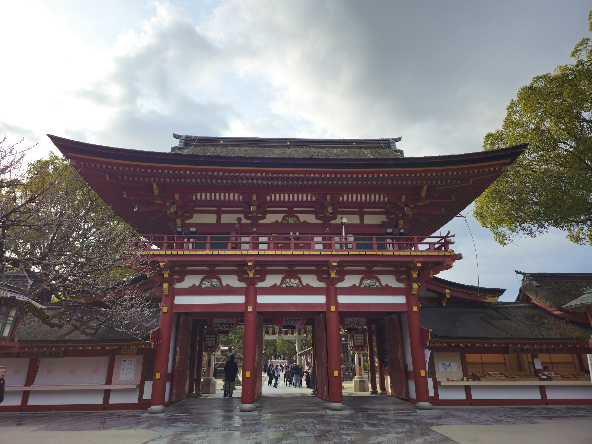

#### 其他
- 行政區：日本・福岡縣 太宰府市
- 交通：
  - 從福岡市區常見走法是電車到太宰府站後步行（你確定出發點我再幫你寫最順的轉乘）。
- 預估停留時間：90–150 分鐘（含參道吃逛可拉到 2–3 小時）
- 優先度：必去
- 其他連結：
  - 官網（EN 版入口）：https://www.dazaifutenmangu.or.jp/
  - Wiki（日文）：https://ja.wikipedia.org/wiki/%E5%A4%AA%E5%AE%B0%E5%BA%9C%E5%A4%A9%E6%BA%80%E5%AE%AE

### 其他
- 地址（Wiki 記載）：福岡県太宰府市宰府4丁目7番1号
---
# [景點] 寶滿宮 竃門神社（Hōmangū Kamado Shrine / 宝満宮竈門神社）
> 座標: 33.528838, 130.552531
> 地址: 〒818-0115 福岡県太宰府市内山８８３
> 連結: https://www.google.com/maps/place/%E5%AE%9D%E6%BA%80%E5%AE%AE+%E7%AB%88%E9%96%80%E7%A5%9E%E7%A4%BE/@33.5288381,130.5525313,17z/data=!3m1!4b1!4m6!3m5!1s0x35419b62bebd8eff:0x1680bb62fa4ab75b!8m2!3d33.5288381!4d130.5525313!16s%2Fm%2F010xdvyv?hl=ja

### 想做什麼
- 神社參拜＋拍照（山上/森林氛圍）
- 若你對《鬼滅之刃》聖地有興趣：這裡在旅遊圈常被一起提到（但我先不把它寫成定論，免得誤導；你要我再查更細來源我再補）

### 備註
- 位在太宰府一帶，通常可跟「太宰府天滿宮」同一天規劃（你說先不排行程，我先只做關聯提示）。
- 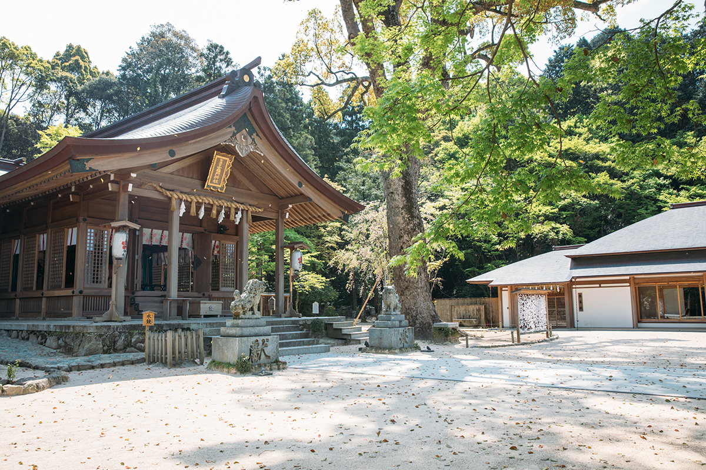

#### 其他
- 行政區：日本・福岡縣 太宰府市（寶滿山／太宰府近郊）
- 交通：
  - 從太宰府周邊上山；自駕/計程車會比較省力。若你之後確定出發點我再補大眾運輸。
- 預估停留時間：60–120 分鐘
- 優先度：想去
- 其他連結：
  - 官網：https://kamadojinja.or.jp/

### 其他
- 地址（官網）：〒818-0115 福岡県太宰府市内山883
- 電話（官網）：092-922-4106（9:00–17:00）
---
# [景點] 宮地嶽神社（Miyajidake Shrine / 宮地嶽神社）
> 座標: 33.779914, 130.486233
> 地址: 〒811-3309 福岡県福津市宮司元町７−１
> 連結: https://www.google.com/maps/place/%E5%AE%AE%E5%9C%B0%E5%B6%BD%E7%A5%9E%E7%A4%BE/@33.7795657,130.4852639,18z/data=!4m10!1m2!2m1!1z5a6u5Zyw5ba956We56S-!3m6!1s0x35419922725ab3e9:0xed12b5521ed2943c!8m2!3d33.7799141!4d130.4862328!15sCg_lrq7lnLDltr3npZ7npL5aEyIR5a6u5ZywIOW2vSDnpZ7npL6SAQ1zaGludG9fc2hyaW5l4AEA!16s%2Fm%2F0fpj0bb?hl=ja
> Day: 1

### 想做什麼
- 神社參拜＋拍照（大型注連繩/拝殿）
- 拍「參道直線＋夕陽」的構圖（若剛好遇到光之道時段）

### 備註
- 位於福津市；以「光之道（夕陽沿參道直線落下）」概念知名（是否出現取決於季節與天氣）。
- 主祭神：神功皇后（Jingū）。
- 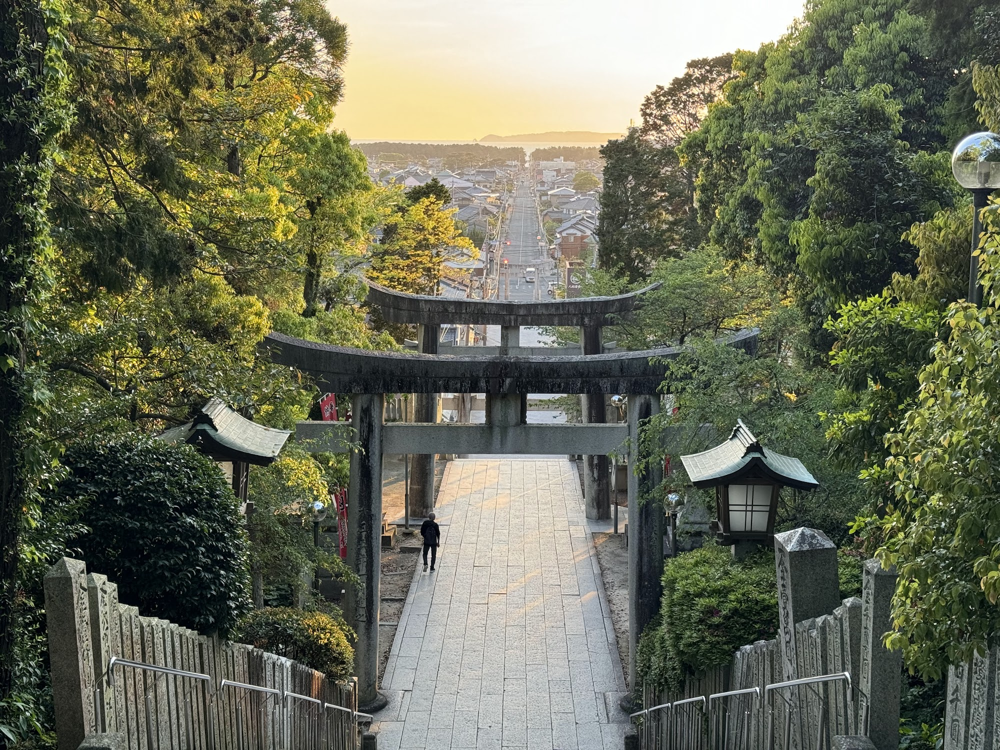
#### 其他
- 行政區：日本・福岡縣 福津市（Fukutsu）
- 交通：
  - 可從福岡市區搭 JR 到福間站（Fukuma）後轉乘交通工具前往（依當天起點與班次再細化）。
- 預估停留時間：45–90 分鐘（含拍照＋參拜）
- 優先度：想去
- 其他連結：
  - IG（你提供）：https://www.instagram.com/reel/DQEsYNRkSPo/?igsh=ZTVqYWgyZXNidGtp
  - 官方網站：http://www.miyajidake.or.jp/
  - Wiki（EN）：https://en.wikipedia.org/wiki/Miyajidake_Shrine
  - Wiki（日文）：https://ja.wikipedia.org/wiki/%E5%AE%AE%E5%9C%B0%E5%B6%BD%E7%A5%9E%E7%A4%BE
---
# [景點] 櫻井神社（桜井神社 / Sakurai Shrine）
> 座標: 33.628159, 130.191943
> 地址: 〒819-1304 福岡県糸島市志摩桜井４２２７
> 連結: https://www.google.com/maps/place/%E6%AB%BB%E4%BA%95%E7%A5%9E%E7%A4%BE/@33.6281591,130.1919425,17z/data=!3m1!4b1!4m6!3m5!1s0x3541eed139c6ec77:0x6900db79724be0dc!8m2!3d33.6281591!4d130.1919425!16s%2Fg%2F11bxff39tf?hl=ja
> Day: 2

### 想做什麼
- 神社參拜＋拍照（拝殿/楼門/本殿，歷史建築）
- 若順路：搭配「櫻井二見ヶ浦（夫婦岩＋白鳥居）」拍海景/夕陽

### 備註
- 糸島北部的代表神社之一；社殿群（本殿/拝殿/楼門）具文化財等級評價（近年有「重要文化財指定」相關資訊）。
- 參拜 24 小時；授与所常見 9:00–17:00（以現場公告為準）。
- 二見ヶ浦偏夕陽向：想拍「夫婦岩之間落日」可注意夏至前後時段與天氣。
- 

#### 其他
- 行政區：日本・福岡縣 糸島市（Itoshima）
- 交通：
  - 從博多/天神可搭高速巴士到「桜井」站再步行約 15 分（班次不密，建議先查）。
  - 或從 JR 筑前前原轉巴士（部分路線到桜井/二見ヶ浦一帶）。
- 預估停留時間：30–60 分鐘（神社本體）／60–120 分鐘（含二見ヶ浦拍照）
- 優先度：想去
- 其他連結：
  - IG（你提供）：https://www.instagram.com/reel/DUYEGcRk4zy/?igsh=dGtudnh0d2R6YmNp
  - 官方網站：https://sakuraijinja.com/
  - 糸島觀光協會介紹：https://kanko-itoshima.jp/spot/sakuraijinja/
  - 櫻井二見ヶ浦（福岡觀光）：https://www.crossroadfukuoka.jp/tw/spot/12456
---
# [景點] 雷山千如寺 大悲王院（雷山千如寺 / Raizan Sennyoji Taihioin）
> 座標: 33.494446, 130.228718
> 地址: 〒819-1145 福岡県糸島市雷山６２６
> 連結: https://www.google.com/maps/place/%E9%9B%B7%E5%B1%B1%E5%8D%83%E5%A6%82%E5%AF%BA+%E5%A4%A7%E6%82%B2%E7%8E%8B%E9%99%A2/@33.4944456,130.2239542,17z/data=!4m10!1m2!2m1!1z6Zu35bGx5Y2D5aaC5a-65aSn5oKy546L6Zmi!3m6!1s0x3541c17f924b8755:0xc82a41f9b4e4b785!8m2!3d33.4944456!4d130.2287178!15sChvpm7flsbHljYPlpoLlr7rlpKfmgrLnjovpmaJaIyIh6Zu35bGxIOWNgyDlpoIg5a-6IOWkp-aCsiDnjosg6ZmikgEPYnVkZGhpc3RfdGVtcGxl4AEA!16s%2Fg%2F11cnddg15p?hl=ja

### 想做什麼
- 寺院參拜＋拍照（山寺氛圍）
- 看季節景色（常見是秋天紅葉有名；你若確定月份我再補最佳拍點）

### 備註
- Google Maps 顯示名稱：雷山千如寺大悲王院 / Raizansennyoji Taihioin。
- 官網有提到拝観料調整公告（若你要去我再幫你抓最新票價/開放時間頁）。
- 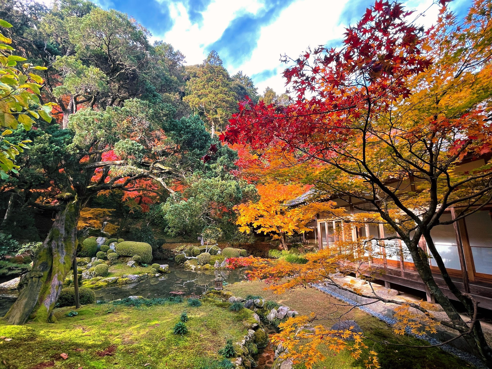

#### 其他
- 行政區：日本・福岡縣 糸島市（雷山／Itoshima 山區）
- 交通：
  - 建議自駕/計程車較順（在山區）；若你之後確定從「博多/天神/筑前前原」出發，我再幫你細化大眾運輸。
- 預估停留時間：45–90 分鐘
- 優先度：想去
- 其他連結：
  - 官網：https://sennyoji.or.jp/

### 其他
- 地址（官網 404 頁面/站內 footer 可見）：〒819-1145 福岡県糸島市雷山626
- 電話（官網）：092-323-3547
---
# [景點] 高良大社（Kōra Taisha / 高良大社）
> 座標: 33.301648, 130.565855
> 地址: 〒839-0851 福岡県久留米市御井町１
> 連結: https://www.google.com/maps/place/%E9%AB%98%E8%89%AF%E5%A4%A7%E7%A4%BE/@33.3016484,130.5658549,17z/data=!3m1!4b1!4m6!3m5!1s0x3541a690cf819569:0xc6744d1177c7e41c!8m2!3d33.3016484!4d130.5658549!16s%2Fm%2F0gmh2c1?hl=ja

### 想做什麼
- 神社參拜＋拍照（九州等級很高的一宮/國幣大社系統）
- 從高良山眺望久留米市景（晴天視野好）

### 備註
- 位置在高良山（標高約 312m）上；過去屬「筑後國一宮」，以消災解厄、延命長壽、交通安全等聞名。
- 社殿群被評為重要文化財等級（以官方/觀光資訊為準）。
- 停車場規模大（觀光資訊寫約 300 台），開車上山方便。
- 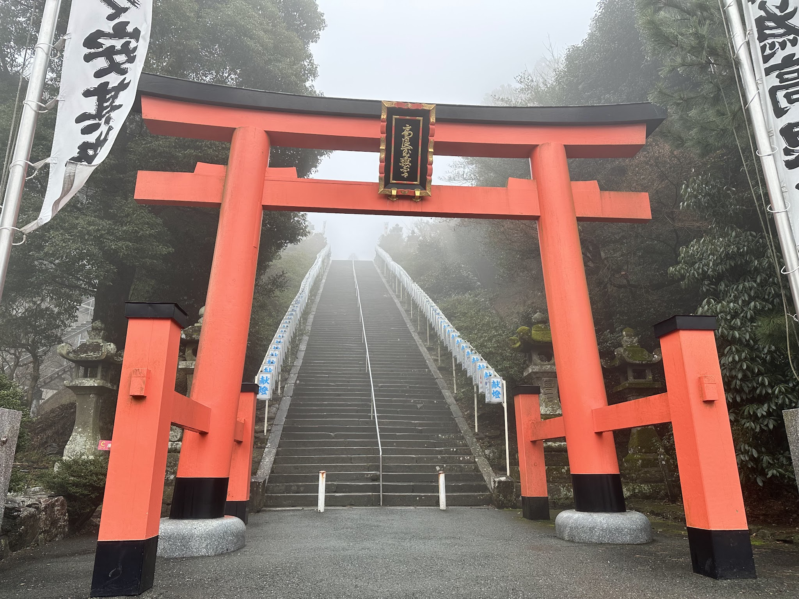

#### 其他
- 行政區：日本・福岡縣 久留米市（高良山）
- 交通：
  - 大眾運輸可到久留米市區後再轉乘；自駕較順。
- 預估停留時間：45–90 分鐘
- 優先度：想去
- 其他連結：
  - IG（你提供）：https://www.instagram.com/reel/DT2ljiWj46x/?utm_source=ig_web_copy_link&igsh=NTc4MTIwNjQ2YQ==
  - IG（你補充）：https://www.instagram.com/reel/DTfDF7qAdi4/?igsh=dDNsMjIzYjYwNWo0
  - 官方網站：http://www.kourataisya.or.jp/
  - Wiki（日文）：https://ja.wikipedia.org/wiki/%E9%AB%98%E8%89%AF%E5%A4%A7%E7%A4%BE
  - 福岡觀光（Crossroad Fukuoka）：https://www.crossroadfukuoka.jp/tw/spot/13622
  - 久留米觀光：https://welcome-kurume.com/tw/spots/detail/8b8be88c-7e83-4b47-ad84-382e5d64b622
---
# [景點] 日輪寺（Nichirin-ji / 日輪寺）
> 座標: 33.039782, 130.685517
> 地址: 〒861-0552 熊本県山鹿市杉１６０７
> 連結: https://www.google.com/maps/place/%E6%97%A5%E8%BC%AA%E5%AF%BA/@33.0397816,130.6855172,17z/data=!3m2!4b1!5s0x3540fe30aa3e4467:0x4db306f1df525235!4m6!3m5!1s0x3540fe3a0712dff3:0x554daca29a777d7c!8m2!3d33.0397816!4d130.6855172!16s%2Fg%2F1w8w7slf?authuser=0

### 想做什麼
- （待補）

### 備註
- 目前我這邊 IG 在未登入狀態看不到 Reel 內容，無法確認是「哪個縣市/哪一座日輪寺」（同名寺院不少）。
- 你把影片內文（caption）貼給我，或告訴我它在「熊本/福岡/佐賀…哪裡」，我就能補齊行政區、交通與停留時間。
- 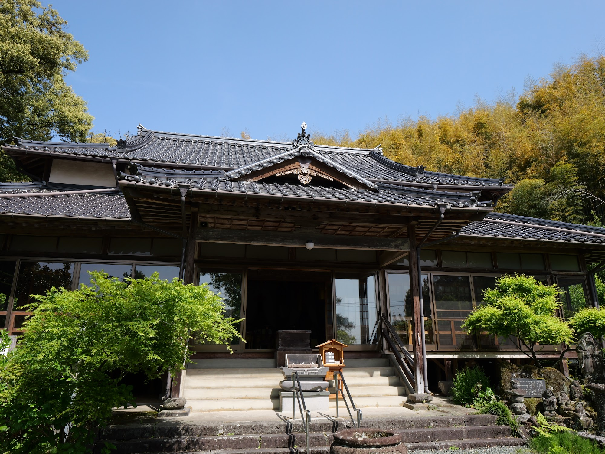

#### 其他
- 行政區：日本・熊本縣（以 Google Maps 連結為準）
- 交通：（待補）
- 預估停留時間：（待補）
- 優先度：想去
- 其他連結：
  - IG（你提供）：https://www.instagram.com/reel/DTuZIz_kipy/?igsh=Z2d2OHVuNjVob2E4
---
# [景點] 高住神社（Takasumi Jinja / 高住神社）
> 座標: 33.484136, 130.932932
> 地址: 〒824-0721 福岡県田川郡添田町英彦山２７
> 連結: https://www.google.com/maps/place/%E9%AB%98%E4%BD%8F%E7%A5%9E%E7%A4%BE/@33.4841355,130.9329323,17z/data=!3m1!4b1!4m6!3m5!1s0x354160cc1b571701:0x680e424a1dc6aa79!8m2!3d33.4841355!4d130.9329323!16s%2Fg%2F1tdn1vyh?authuser=0&hl=ja

### 想做什麼
- 神社參拜＋拍照（英彦山周邊山林神社氛圍）

### 備註
- 這個點位在山區，建議以自駕/計程車為主；若你確定從哪裡出發（博多/天神/久留米…），我再幫你補最順的交通寫法。
- 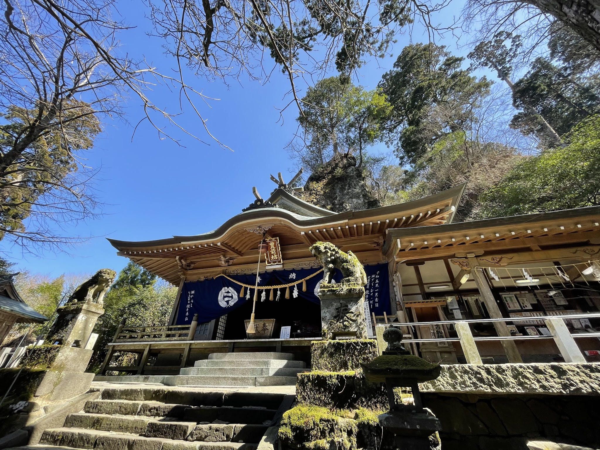

#### 其他
- 行政區：日本・福岡縣 田川郡 添田町（Hikosan／英彦山一帶）
- 交通：
  - 建議自駕。
- 預估停留時間：30–60 分鐘
- 優先度：想去
- 其他連結：
  - IG（你提供）：https://www.instagram.com/reel/DUcwFRbgQpF/?igsh=bmhhNjM1eXRoM3A2
  - 官網（Google Maps 顯示；可能有 Cloudflare 擋爬蟲）：https://takasumi-jinja.jimdofree.com/

### 其他
- 地址（Google Maps）：27 Hikosan, Soeda, Tagawa District, Fukuoka 824-0721 日本
- 電話（Google Maps）：+81 947-85-0073
---
# [美食] 博多水炊き専門 橙
> 座標: 33.589628, 130.381484
> 地址: 〒810-0074 福岡県福岡市中央区大手門１丁目８−１４
> 連結: https://www.google.com/maps/place/%E5%8D%9A%E5%A4%9A%E6%B0%B4%E7%82%8A%E9%8D%8B%E5%B0%82%E9%96%80+%E6%A9%99/@33.5896279,130.3814835,17z/data=!3m1!4b1!4m6!3m5!1s0x3541922de9fb3c6f:0xd6b65ac17fda1202!8m2!3d33.5896279!4d130.3814835!16s%2Fg%2F11cmnl6yyp?hl=ja
> Day: 1

### 想做什麼
- 吃水炊き（雞肉鍋）
- **必加點：雜炊（ぞうすい）** 收尾

### 備註
- 用餐節奏通常是：水炊き → 加料 → 最後雜炊/麵收尾；你已指定要雜炊，記得一開始就跟店員講（避免湯底被調整得不適合做雜炊）。
- 可能需要訂位（尤其晚餐時段/週末）；若到場才排隊，整餐時間會被拉長。
- 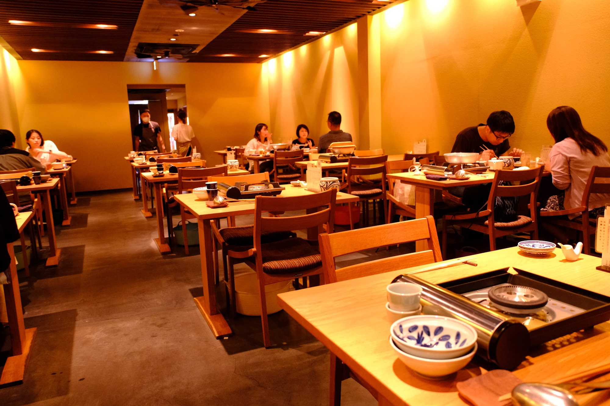

#### 其他
- 行政區：日本・福岡縣 福岡市（博多/中洲一帶；以實際 Google Maps 定位為準）
- 交通：
  - 建議搭地鐵/步行（福岡市區移動方便）。
- 預估停留時間：90–120 分鐘
- 優先度：想去
- 其他連結：
  - Place ID（Google Maps ftid）：0x3541922de9fb3c6f:0xd6b65ac17fda1202
  - Tabelog：https://tabelog.com/fukuoka/A4001/A400105/40035537/
  - 其他參考（Navitime）：https://www.navitime.co.jp/poi?spot=01125-fbm8001
---
# [美食] めんたい料理 博多 椒房庵（Shobōan / 椒房庵）
> 座標: 33.589968, 130.420050
> 地址: 〒812-0012 福岡県福岡市博多区博多駅中央街１−１ AMU PLAZA博多 9F
> 連結: https://www.google.com/maps/place/%E3%82%81%E3%82%93%E3%81%9F%E3%81%84%E6%96%99%E7%90%86+%E5%8D%9A%E5%A4%9A+%E6%A4%92%E6%88%BF%E5%BA%B5/@33.5899682,130.4200497,17z/data=!3m1!4b1!4m6!3m5!1s0x3541918b58a1d6a7:0x9804f03a3d2cf9a1!8m2!3d33.5899682!4d130.4200497!16s%2Fg%2F11b6d1h9cb?hl=ja

### 想做什麼
- 吃明太子料理（招牌「博多 めん鯛まぶし」：明太子＋鯛茶漬け概念）

### 備註
- 公式介紹寫：位於 JR博多駅構内 JR博多シティ「くうてん」9F。
- 招牌「めん鯛まぶし」吃法：先擠檸檬、再加月見とろろ、最後做成だし茶漬け（官方文案）。
- 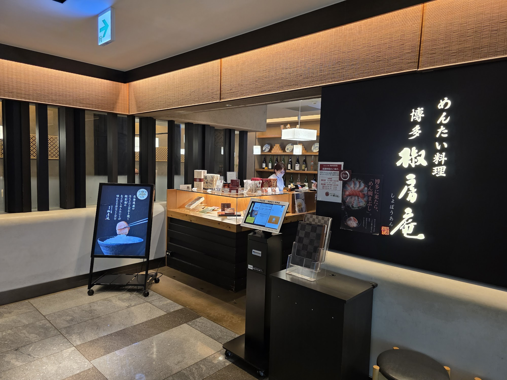

#### 其他
- 行政區：日本・福岡縣 福岡市 博多區（博多站／JR博多シティ「くうてん」）
- 交通：
  - 就在博多站商場內，搭 JR / 地鐵到博多站後步行最方便。
- 預估停留時間：60–90 分鐘
- 優先度：想去
- 其他連結：
  - 官方店鋪介紹（久原本家/椒房庵）：https://www.kubara.jp/shoplist/shobouan/
  - 訂位（Google Maps 顯示 / hitosara）：https://hitosara.com/0004028039/

### 其他
- 價位（Google Maps）：¥2,000–3,000 / 人（多人回報）
- 地址（Google Maps）：日本〒812-0012 Fukuoka, Hakata Ward, Hakataekichuogai, 1−1 9F（AMU PLAZA博多／くうてん 9F）
- 電話（Google Maps）：+81 92-409-6611
---
# [美食] 水炊名店 鳥田 博多本店（とり田 / Toriden Hakata Honten）
> 座標: 33.596036, 130.405893
> 地址: 〒812-0027 福岡県福岡市博多区下川端町１０−５ 1F
> 連結: https://www.google.com/maps/place/%E3%81%A8%E3%82%8A%E7%94%B0+%E5%8D%9A%E5%A4%9A%E6%9C%AC%E5%BA%97/@33.5960356,130.4058933,17z/data=!3m1!4b1!4m6!3m5!1s0x354191eb5f944fb3:0x2ddd57f80ebe8891!8m2!3d33.5960356!4d130.4058933!16s%2Fg%2F11b700sk7g?hl=ja

### 想做什麼
- 吃博多名物水炊き（雞湯火鍋）
- 也有人會點胡麻鯖等九州料理（以店家當季/套餐為準）

### 備註
- Google Maps 顯示：可內用、可外帶、可外送。
- 人氣店，尖峰時段建議先訂位。
- 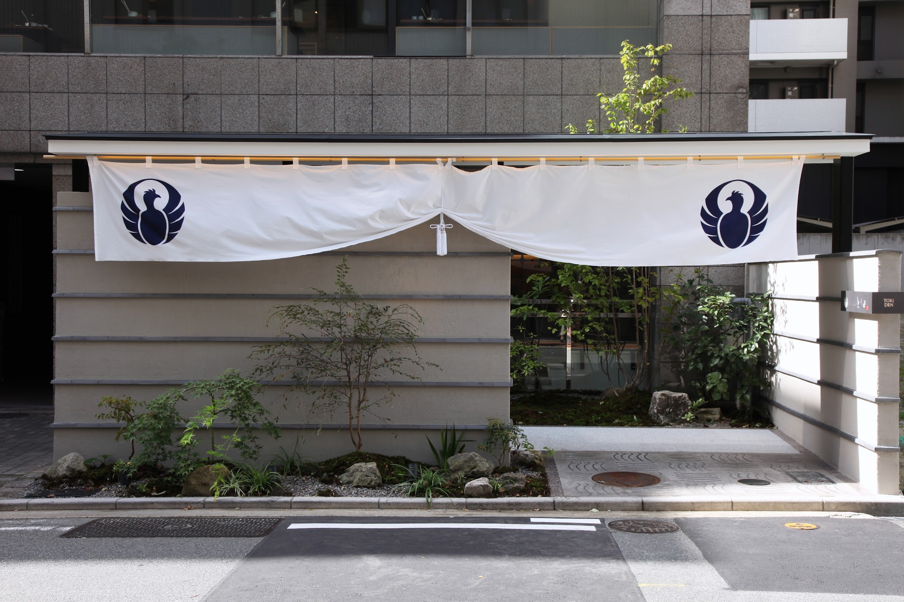

#### 其他
- 行政區：日本・福岡縣 福岡市 博多區（下川端町／中洲川端一帶）
- 交通：
  - 福岡市區：地鐵＋步行很順（靠近中洲川端/川端商店街一帶）。
- 預估停留時間：90–120 分鐘
- 優先度：想去
- 其他連結：
  - 官網：https://toriden.com/
  - 訂位（Google Maps 顯示 / TableCheck）：https://www.tablecheck.com/shops/toriden-hakata/reserve
  - 菜單（Google Maps 顯示 / PDF）：https://toriden.com/pdf/menu_hakata.pdf

### 其他
- 地址（Google Maps）：日本〒812-0027 Fukuoka, Hakata Ward, Shimokawabatamachi, 10−5 1F
- 電話（Google Maps）：+81 92-272-0920
---
# [美食] PRESS BUTTER SAND 博多站店
> 座標: 33.590427, 130.420820
> 地址: 〒812-0012 福岡県福岡市博多区博多駅中央街１−１ JR九州博多駅構内
> 連結: https://www.google.com/maps/place/PRESS+BUTTER+SAND+%E5%8D%9A%E5%A4%9A%E9%A7%85%E5%BA%97/@33.5904268,130.4208199,17z/data=!3m1!4b1!4m6!3m5!1s0x3541916094556369:0x8b7c1fad56f6c6c2!8m2!3d33.5904268!4d130.4208199!16s%2Fg%2F11h7zbrz3t?hl=ja

### 想做什麼
- 買伴手禮甜點（奶油夾心餅乾/バターサンド）
- 如果要送人：適合在回程或轉車時快速購入

### 備註
- Google Maps 顯示：外帶為主（禁止內用）、無外送。
- 營業時間（Google Maps）：至 21:00（依現場/假日可能調整）。
- 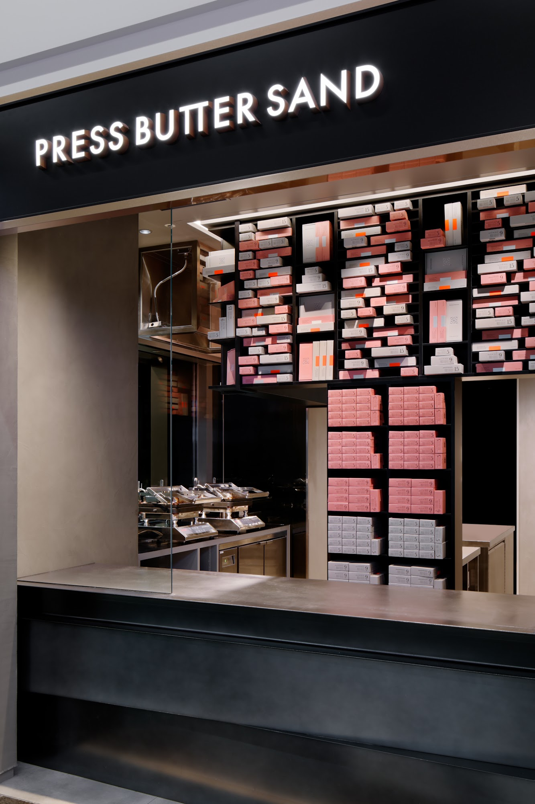

#### 其他
- 行政區：日本・福岡縣 福岡市 博多區（JR九州 博多駅構内）
- 交通：
  - 直接在博多站內，轉車時走路去買最方便。
- 預估停留時間：10–25 分鐘（視排隊）
- 優先度：想去
- 其他連結：
  - 官網（博多站店頁）：https://buttersand.com/shop/hakata-station/
  - 產品頁（Google Maps 的「菜單」連結）：https://buttersand.com/products/

### 其他
- 地址（Google Maps）：日本〒812-0012 Fukuoka, Hakata Ward, Hakataekichuogai, 1−1 JR九州博多駅構内
- 電話（Google Maps）：+81 120-319-235
---
# [美食] Dacomecca（ダコメッカ）
> 座標: 33.587440, 130.419344
> 地址: 〒812-0011 福岡県福岡市博多区博多駅前４丁目１４−１ 博多深見パークビルディング
> 連結: https://www.google.com/maps/place/Dacomecca/@33.5874397,130.4193439,17z/data=!3m1!4b1!4m6!3m5!1s0x3541911ec138f4e3:0x2a5394b017eed42c!8m2!3d33.5874397!4d130.4193439!16s%2Fg%2F11r9w9k1x8?hl=ja

### 想做什麼
- 買麵包/甜點、看「麵包像馬戲團一樣」的陳列（店家品牌文案）
- 想吃熱門品（如明太子麵包等）建議早點去

### 備註
- Google Maps 顯示：可內用、可外帶、無外送。
- 熱門時段（Google Maps）早上較忙；想少排隊可以更早。
- 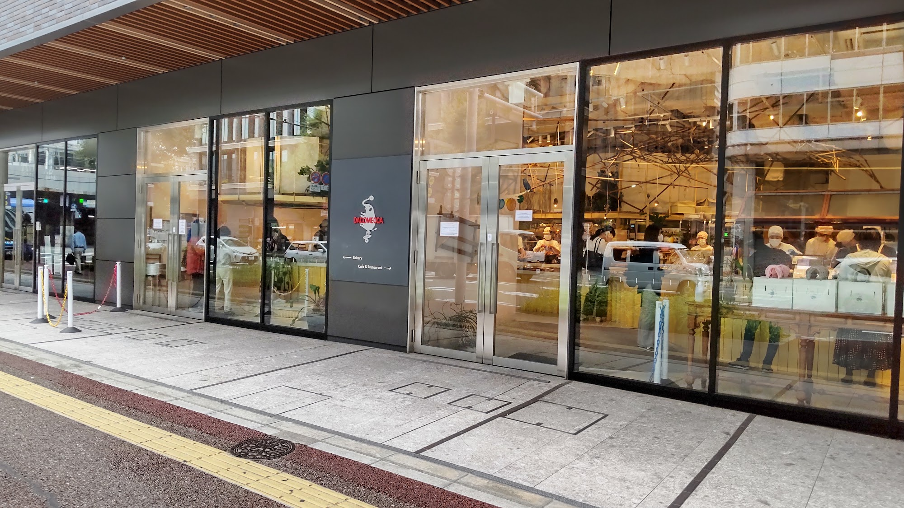

#### 其他
- 行政區：日本・福岡縣 福岡市 博多區（博多駅前一帶）
- 交通：
  - 博多站周邊：地鐵/步行可到（你確定住宿點我再幫你抓最短路線）。
- 預估停留時間：30–60 分鐘（含排隊選購）
- 優先度：想去
- 其他連結：
  - 官網：https://dacomecca.com/

### 其他
- 價位（Google Maps）：¥1,000–2,000 / 人（多人回報）
- 地址（Google Maps）：日本〒812-0011 Fukuoka, Hakata Ward, Hakata Ekimae, 4 Chome−14−1 博多深見パークビルディング（1F）
- 電話（Google Maps）：+81 92-477-1050
---
# [美食] Full full（フルフル パンとワイン / Full full）
> 座標: 33.592237, 130.397264
> 地址: 〒810-0001 福岡県福岡市中央区天神３丁目３−５ FULL FULL BLD1階
> 連結: https://www.google.com/maps/place/%E3%83%95%E3%83%AB%E3%83%95%E3%83%AB+%E3%83%91%E3%83%B3%E3%81%A8%E3%83%AF%E3%82%A4%E3%83%B3/@33.5922368,130.3972642,17z/data=!4m6!3m5!1s0x3541910037dbac71:0x38c86f451bb59218!8m2!3d33.5922368!4d130.3972642!16s%2Fg%2F11w4cj7flb?hl=ja

### 想做什麼
- 買麵包/伴手禮（Google Maps 顯示「明太子フランス」等）
- 若想小酌：店名顯示有「パンとワイン」（以現場為準）

### 備註
- Google Maps 顯示：可內用、可外帶、無外送。
- 官網有多家分店清單；你這個連結是「天神」這家。
- 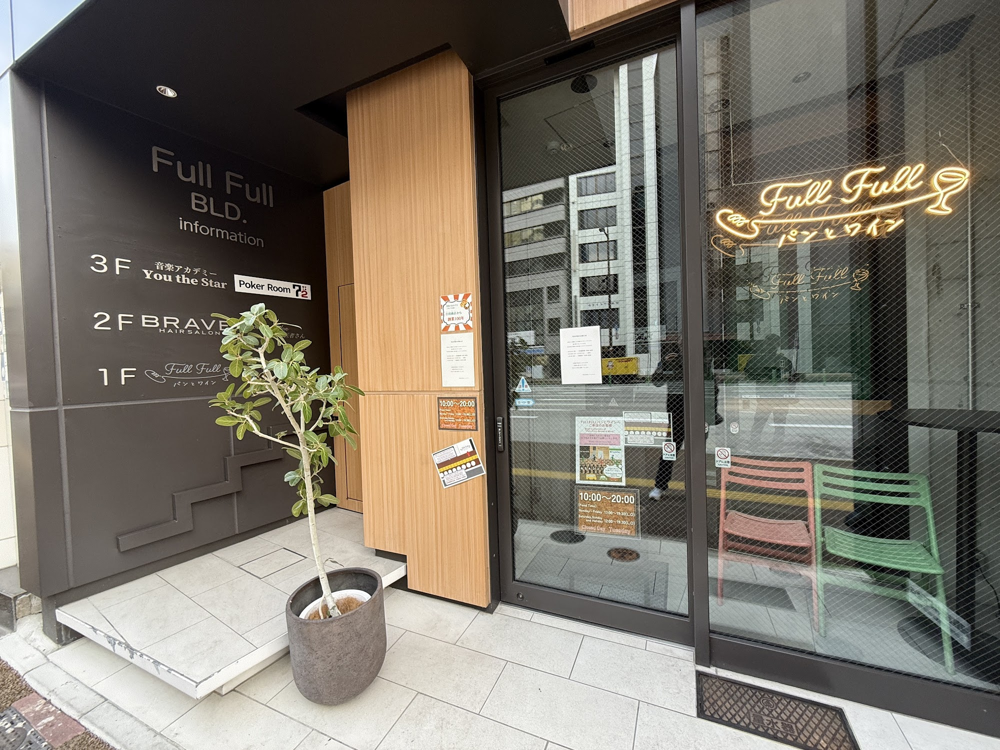

#### 其他
- 行政區：日本・福岡縣 福岡市 中央區 天神
- 交通：
  - 天神商圈步行可到。
- 預估停留時間：20–45 分鐘
- 優先度：想去
- 其他連結：
  - 官網（店鋪列表頁）：https://www.full-full.jp/shop/

### 其他
- 價位（Google Maps）：¥1–1,000 / 人（多人回報）
- 地址（Google Maps）：FULL FULL, BLD1階, 3 Chome-3-5 Tenjin, Chuo Ward, Fukuoka, 810-0001 日本
- 電話（Google Maps）：+81 92-791-7431
---
# [美食] 雞肉料理 地雞屋大和（ぢどり屋 大和 本館 / Jidoriya Yamato Honten）
> 座標: 33.592867, 130.411733
> 地址: 〒812-0039 福岡県福岡市博多区冷泉町２−１２
> 連結: https://www.google.com/maps/place/%E9%9B%9E%E8%82%89%E6%96%99%E7%90%86+%E5%9C%B0%E9%B6%8F%E5%B1%8B%E5%A4%A7%E5%92%8C/@33.5928671,130.4117328,18z/data=!3m1!5s0x354191c0096b68f5:0x1e387a31f66b320c!4m7!3m6!1s0x354191c009318f8d:0x9311a080715d1bde!8m2!3d33.5928671!4d130.4117328!15sChblnLDpm57lsYvlpKflkowg56aP5bKhWhsiGeWcsCDpm54g5bGLIOWkp-WSjCDnpo_lsqGSARtqYXBhbmVzZV9pemFrYXlhX3Jlc3RhdXJhbnTgAQA!16s%2Fg%2F1td5p13j?hl=zh-TW

### 想做什麼
- 吃博多水炊き（雞湯火鍋）
- 吃地雞炭火燒（搭配柚子胡椒常見）
- 小酌：店家酒類選擇多（官方頁提到日本酒約 15 種、燒酎約 20–30 種）

### 備註
- 官方頁提到：使用朝引國產地雞、酒類種類多；有可隔間的個室座位；亦提供外帶。
- Google Maps 顯示：可內用、可外帶、可外送。
- 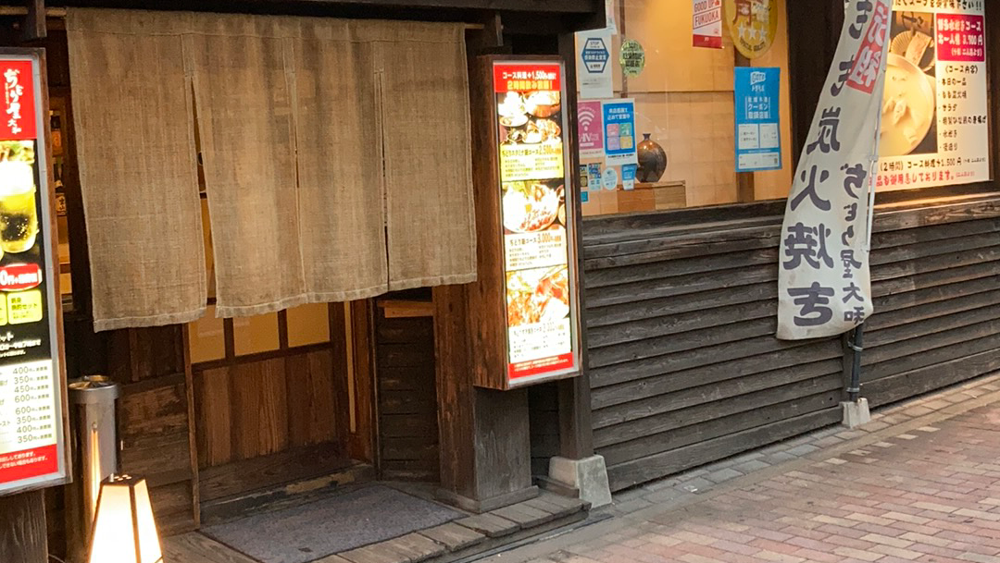

#### 其他
- 行政區：日本・福岡縣 福岡市 博多區（祇園/呉服町一帶）
- 交通：
  - 福岡市區：地鐵＋步行。
- 預估停留時間：90–120 分鐘
- 優先度：想去
- 其他連結：
  - 官方頁（ぐるなび / gorp）：https://f075500.gorp.jp/

### 其他
- 類型標註：**居酒屋（適合喝酒）**
- 價位（Google Maps）：¥4,000–5,000 / 人
- 地址（Google Maps）：2-12 Reisenmachi, Hakata Ward, Fukuoka, 812-0039 日本（1F）
- 電話（Google Maps）：+81 50-5486-4495
---
# [美食] 屋台炒拉麵 小金ちゃん（小金ちゃん / Kokinchan）
> 座標: 33.591158, 130.395662
> 地址: 〒810-0001 福岡県福岡市中央区天神２丁目１４−１３
> 連結: https://www.google.com/maps/place/%E5%B1%8B%E5%8F%B0%E7%82%92%E6%8B%89%E9%BA%BA+%E5%B0%8F%E9%87%91%E3%81%A1%E3%82%83%E3%82%93/@33.5911582,130.3956623,17z/data=!3m1!4b1!4m6!3m5!1s0x3541918fcd92ee73:0xc20c4e655f3ec3f8!8m2!3d33.5911582!4d130.3956623!16s%2Fg%2F1td3p80b?hl=zh-TW

### 想做什麼
- 吃福岡屋台名物：**焼きラーメン（炒拉麵）**
- 感受屋台氛圍（通常需要排隊、多人併桌）

### 備註
- Google Maps 顯示：可內用、無外送。
- 營業時間（Google Maps）：18:15 開始（以現場/天候為準；屋台可能受天氣影響）。
- 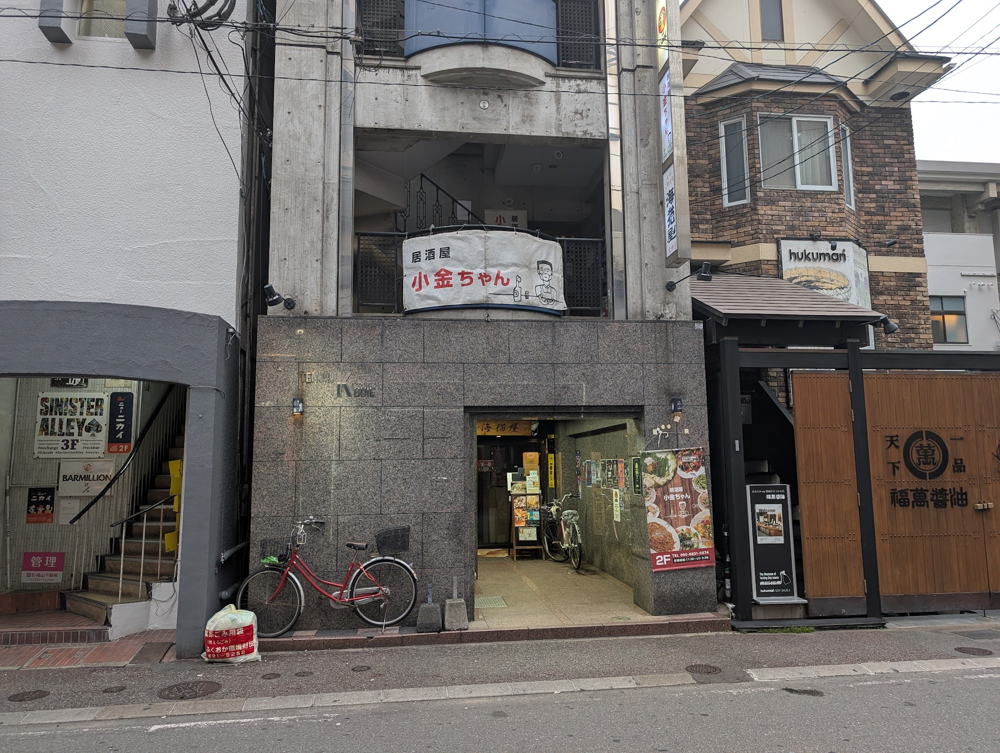

#### 其他
- 行政區：日本・福岡縣 福岡市 中央區 天神
- 交通：
  - 天神市區步行可到；晚餐/宵夜時段建議早點去卡位。
- 預估停留時間：45–90 分鐘（含排隊與用餐）
- 優先度：想去

### 其他
- 價位（Google Maps）：¥2,000–3,000 / 人（多人回報）
- 地址（Google Maps）：2 Chome-14-13 Tenjin, Chuo Ward, Fukuoka, 810-0001 日本
- 電話（Google Maps）：+81 90-3072-4304
---
# [美食] 蜂樂饅頭 熊本上通店（蜂楽饅頭 / Houraku Manju）
> 座標: 32.804206, 130.711021
> 地址: 〒860-0845 熊本県熊本市中央区上通町５−４
> 連結: https://www.google.com/maps/place/%E8%BB%8A%E8%BC%AA%E9%A4%85+%E8%9C%82%E6%A8%82%E9%A5%85%E9%A0%AD/@32.8042059,130.7110214,17z/data=!3m1!4b1!4m6!3m5!1s0x3540f40953bf4c43:0x30e61b1c9d49e395!8m2!3d32.8042059!4d130.7110214!16s%2Fg%2F1tc_nslm?hl=zh-TW

### 想做什麼
- 吃熊本名物點心：蜂樂饅頭（口感很像車輪餅/紅豆餅）
- 逛上通商店街時當作甜點補給

### 備註
- Google Maps 顯示店名為「蜂楽饅頭 熊本上通店」。
- 常見口味是紅豆/白豆沙系；甜度偏日式（可現場看菜單）。
- 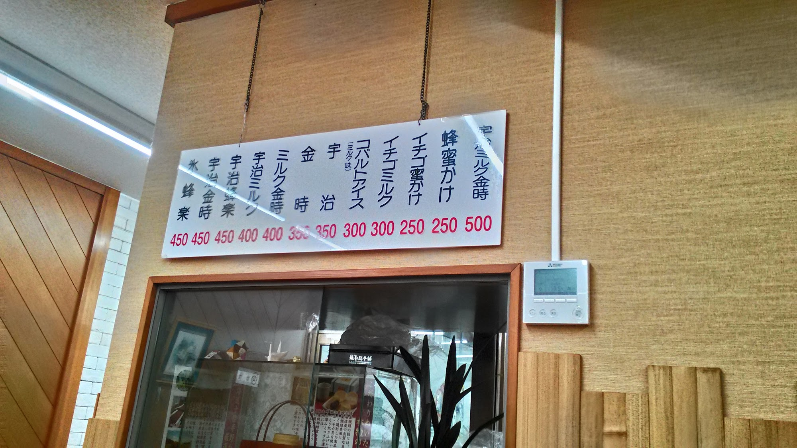

#### 其他
- 行政區：日本・熊本縣 熊本市 中央區（上通）
- 交通：
  - 熊本市區（上通/下通一帶）步行逛街順路。
- 預估停留時間：10–25 分鐘（含排隊購買）
- 優先度：想去
- 其他連結：
  - 官網（Google Maps 顯示）：http://www.houraku.co.jp/

### 其他
- 地址（Google Maps）：5-4 Kamitoricho, Chuo Ward, Kumamoto, 860-0845 日本
- 電話（Google Maps）：+81 96-352-0380
---
# [美食] 勝烈亭 新市街本店（Katsuretsutei Shinshigai Honten / 勝烈亭）
> 座標: 32.798616, 130.705876
> 地址: 〒860-0803 熊本県熊本市中央区新市街８−１８
> 連結: https://www.google.com/maps/place/%E5%8B%9D%E7%83%88%E4%BA%AD+%E6%96%B0%E5%B8%82%E8%A1%97%E6%9C%AC%E5%BA%97/@32.798616,130.705876,17z/data=!3m1!4b1!4m6!3m5!1s0x3540f4727e56aaab:0x796faaff309ab40c!8m2!3d32.798616!4d130.705876!16s%2Fg%2F1tfpmgmf?hl=ja

### 想做什麼
- 吃日式炸豬排（とんかつ）

### 備註
- Google Maps 顯示：可內用、可外帶、無外送。
- 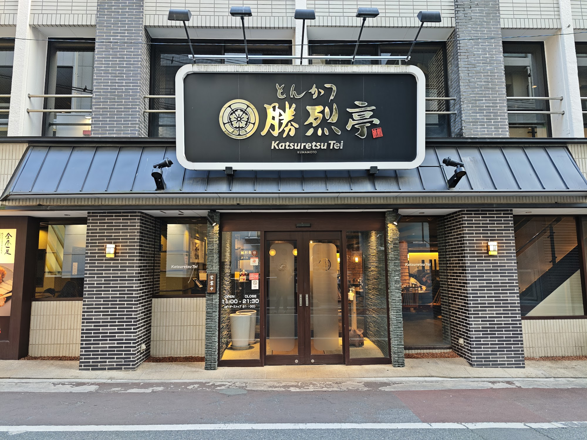

#### 其他
- 行政區：日本・熊本縣 熊本市 中央區（新市街）
- 交通：
  - 熊本市區（新市街商圈）步行/路面電車到市中心後再步行。
- 預估停留時間：60–90 分鐘
- 優先度：想去

### 其他
- 價位（Google Maps）：¥2,000–3,000 / 人（多人回報）
- 地址（Google Maps）：8-18 Shinshigai, Chuo Ward, Kumamoto, 860-0803 日本
- 電話（Google Maps）：+81 96-322-8771
---
# [景點] Sabataro（さばたろう）
> 座標: 33.586439, 130.390627
> 地址: 〒810-0042 福岡県福岡市中央区赤坂１丁目５−１１
> 連結: https://www.google.com/maps/place/%E3%81%95%E3%81%B0%E3%81%9F%E3%82%8D%E3%81%86/@33.5864386,130.3906274,17z/data=!3m1!4b1!4m6!3m5!1s0x354191997d90a329:0x9054243a8717670b!8m2!3d33.5864386!4d130.3906274!16s%2Fg%2F11tsjrd2_x?hl=ja

### 想做什麼
- 吃早餐/早午餐（偏定食：鯖魚、茶泡飯等；看評論關鍵字）
- 想吃的話建議先訂位（Google Maps 顯示可用 TableCheck 預約）

### 備註
- Google Maps 顯示：可內用、可店外取貨、無外送。
- 熱門時段可能偏早（早餐店型），建議開店時段就去或先預約。
- 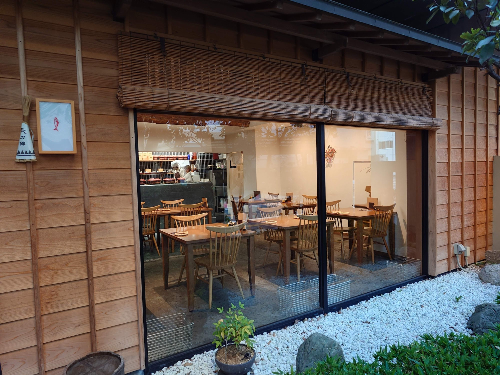

#### 其他
- 行政區：日本・福岡縣 福岡市 中央區 赤坂
- 交通：
  - 市區移動：地鐵＋步行（赤坂/天神一帶）；之後你確定住宿點我再幫你抓最順路線。
- 預估停留時間：60–90 分鐘
- 優先度：想去
- 其他連結：
  - IG（Google Maps 顯示）：https://www.instagram.com/sabataro2023/
  - 訂位（Google Maps 顯示 / TableCheck）：https://www.tablecheck.com/shops/sabataro/reserve

### 其他
- 價位（Google Maps）：¥2,000–3,000 / 人（多人回報）
- 地址（Google Maps）：1 Chome-5-11 Akasaka, Chuo Ward, Fukuoka, 810-0042 日本
- 電話（Google Maps）：+81 92-406-4388
---
# [美食] Pain Stock Tenjin（パンストック天神店）
> 座標: 33.591652, 130.404042
> 地址: 〒810-0002 福岡県福岡市中央区西中洲６−１７
> 連結: https://www.google.com/maps/place/Pain+Stock+Tenjin/@33.5916517,130.4040419,17z/data=!3m1!4b1!4m6!3m5!1s0x35419172d76cdbcf:0x30a9b694e5ca2b43!8m2!3d33.5916517!4d130.4040419!16s%2Fg%2F11hdsbj3xk?hl=ja

### 想做什麼
- 買麵包/咖啡、拍麵包店日常街景
- **明太子麵包**（你註記：要在櫃檯點）

### 備註
- 你註記：**要排隊**、**明太子麵包要在櫃檯點**、**可以內用**。
- 建議避開尖峰：開店後不久/平日比較好買；想內用就先卡座位再逛（依現場規則）。
- 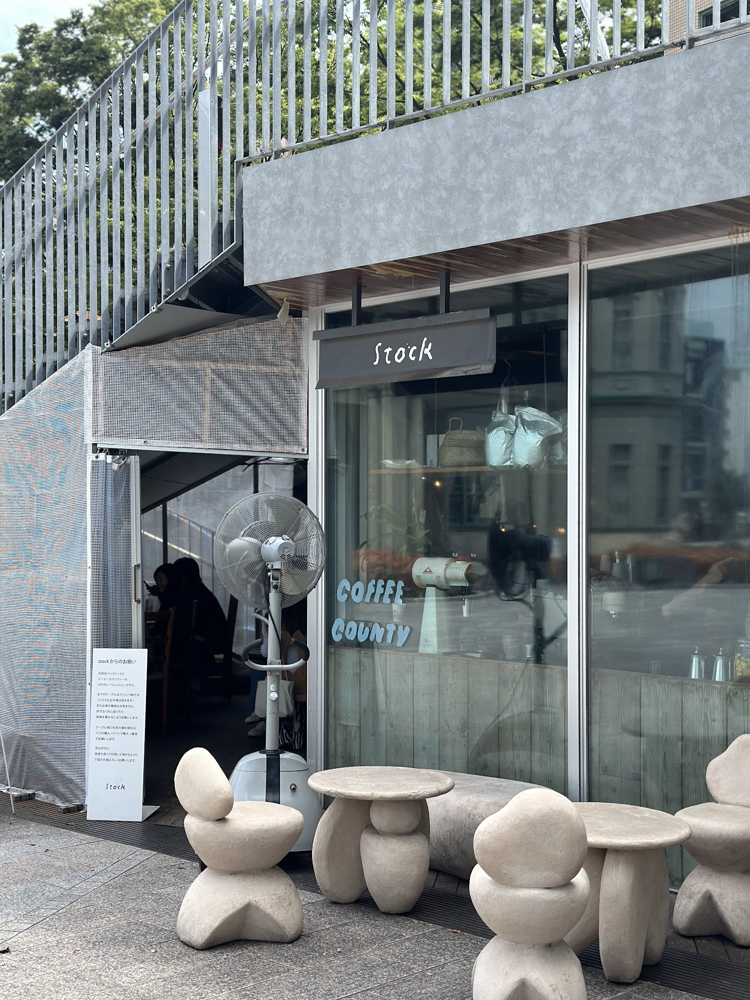

#### 其他
- 行政區：日本・福岡縣 福岡市中央區（天神/赤坂一帶；以實際 Google Maps 定位為準）
- 交通：
  - 天神周邊：地鐵＋步行最順。
- 預估停留時間：20–45 分鐘（買麵包）／45–75 分鐘（含內用）
- 優先度：想去
- 其他連結：
  - Place ID（Google Maps ftid）：0x35419172d76cdbcf:0x30a9b694e5ca2b43
  - Tabelog：https://tabelog.com/fukuoka/A4001/A400103/40052317/
  - 官方/相關：https://stockonlineshop.com/
---
# [美食] 博多もつ鍋前田屋 博多店
> 座標: 33.589190, 130.416474
> 地址: 〒812-0011 福岡県福岡市博多区博多駅前３丁目２６−５
> 連結: https://www.google.com/maps/place/%E5%8D%9A%E5%A4%9A%E7%89%9B%E9%9B%9C%E9%8D%8B%E5%89%8D%E7%94%B0%E5%B1%8B+%E5%8D%9A%E5%A4%9A%E5%BA%97/@33.5891902,130.4164739,17z/data=!3m1!4b1!4m6!3m5!1s0x354191b8cf465de3:0xba51a47ac9a69d30!8m2!3d33.5891902!4d130.4164739!16s%2Fg%2F11c3v6c8q7?hl=ja
> Day: 3

### 想做什麼
- 吃もつ鍋（牛腸鍋）/ 已訂位4/20 19:30

### 備註
- 熱門時段可能需要排隊；若行程卡很緊，建議提早去或用可訂位管道先確認。
- 若可訂位：建議先訂（晚餐尖峰很容易滿）。
- 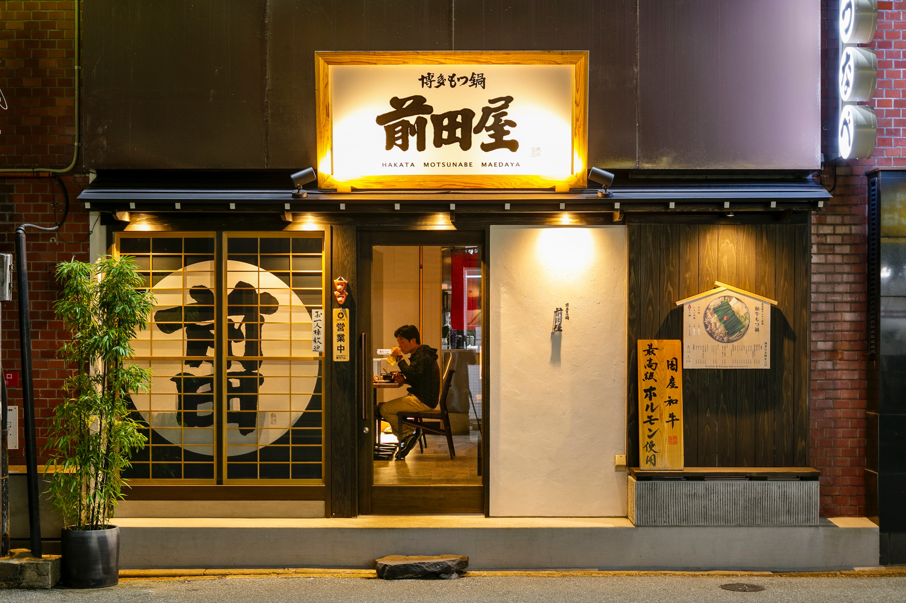

#### 其他
- 行政區：日本・福岡縣 福岡市 博多區（博多站周邊；以實際 Google Maps 定位為準）
- 交通：
  - 博多站步行圈很方便。
- 預估停留時間：60–90 分鐘
- 優先度：想去
- 其他連結：
  - Place ID（Google Maps place_id）：ChIJ411Gz7iRQTURMJ2myXqkUbo
  - Place ID（Google Maps ftid）：0x354191b8cf465de3:0xba51a47ac9a69d30
  - Tabelog：https://tabelog.com/fukuoka/A4001/A400101/40040925/
  - 官網（店鋪資訊入口）：https://motsunabe-maedaya.com/store/honten/
---
# [美食] 牛腸鍋 六花舍（もつ鍋 六花舎 / Motsunabe Rokkasha）
> 座標: 33.586939, 130.419149
> 地址: 〒812-0011 福岡県福岡市博多区博多駅前４丁目１３−２７ グランドハイツ博多 1F
> 連結: https://www.google.com/maps/place/%E3%82%82%E3%81%A4%E9%8D%8B+%E5%85%AD%E8%8A%B1%E8%88%8E/@33.5869388,130.4191486,17z/data=!3m1!4b1!4m6!3m5!1s0x354191b9ae353521:0x12bbd111990ae152!8m2!3d33.5869388!4d130.4191486!16s%2Fg%2F11f2wd89m8?hl=ja

### 想做什麼
- 吃もつ鍋（牛腸鍋）
- 收尾可考慮雜炊/麵（看店家湯底與現場推薦）

### 備註
- Google Maps 顯示：內用、不可外帶、無外送。
- 熱門晚餐時段建議先預約或提早去。
- 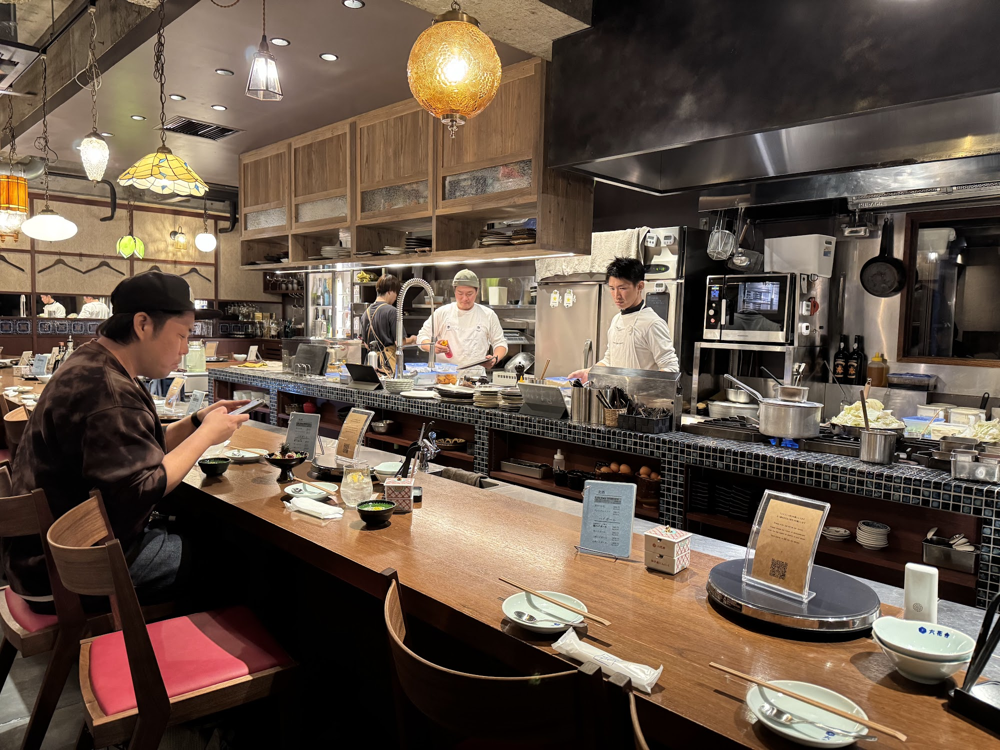

#### 其他
- 行政區：日本・福岡縣 福岡市 博多區（博多站周邊／博多駅前一帶）
- 交通：
  - 博多站步行/市區移動（地鐵＋步行）都方便。
- 預估停留時間：60–90 分鐘（含等待視時段）
- 優先度：想去

### 其他
- 地址（由 Google Maps 條目顯示的所在建物）：4 Chome-13-27 Hakata Ekimae, Hakata Ward, Fukuoka, 812-0011 日本（1F）
---
# [美食] 博多らーめん ShinShin 天神本店（博多ラーメン ShinShin 天神本店）
> 座標: 33.592750, 130.396845
> 地址: 〒810-0001 福岡県福岡市中央区天神３丁目２−１９
> 連結: https://www.google.com/maps/place/%E5%8D%9A%E5%A4%9A%E6%8B%89%E9%BA%B5+ShinShin+%E5%A4%A9%E7%A5%9E%E6%9C%AC%E5%BA%97/@33.5927497,130.3968446,17z/data=!3m1!4b1!4m6!3m5!1s0x3541918ebfe75069:0x6950635bd344e25a!8m2!3d33.5927497!4d130.3968446!16s%2Fg%2F11c3k6mgc2?hl=ja

### 想做什麼
- 吃博多豚骨拉麵
- 炒飯要點

### 備註
- 你聽說需要提前預約：我建議以店家公告/現場規則為準（這類拉麵名店多數是現場排隊制）。
- 保守策略：避開 12:00–13:30、18:30–20:30 尖峰；想吃就早點去排。
- 

#### 其他
- 行政區：日本・福岡縣 福岡市中央區 天神
- 交通：
  - 天神站步行圈。
- 預估停留時間：30–75 分鐘（含排隊視時段）
- 優先度：想去
- 其他連結：
  - Place ID（Google Maps ftid）：0x3541918ebfe75069:0x6950635bd344e25a
  - Tabelog：https://tabelog.com/fukuoka/A4001/A400103/40004980/
---
# [住宿] 多美迎 PREMIUM 博多運河城前飯店（Dormy Inn Premium Hakata Canal City Mae）
> 座標: 33.590619, 130.412306
> 地址: 〒812-0038 福岡県福岡市博多区祇園町９−１
> 連結: https://www.google.com/maps/place/%E3%83%89%E3%83%BC%E3%83%9F%E3%83%BC%E3%82%A4%E3%83%B3PREMIUM%E5%8D%9A%E5%A4%9A%E3%83%BB%E3%82%AD%E3%83%A3%E3%83%8A%E3%83%AB%E3%82%B7%E3%83%86%E3%82%A3%E5%89%8D/@33.5906185,130.4123063,17z/data=!4m9!3m8!1s0x354191bfcbf85827:0x689f429ce43d2dd!5m2!4m1!1i2!8m2!3d33.5906185!4d130.4123063!16s%2Fg%2F1w66359d?hl=ja

### 想做什麼
- 作為福岡市區據點（走路/地鐵方便）
- Dormy Inn 系列：通常主打大浴場/宵夜拉麵（實際以飯店公告為準）

### 備註
- 旅客評論常提：門口/附近就是地鐵站（櫛田神社前站 Kushida-jinja-mae Station 一帶）。
- 

#### 其他
- 行政區：日本・福岡縣 福岡市 博多區（Hakata / 祇園一帶、近運河城）
- 交通：
  - 櫛田神社前站步行圈；到博多站/天神通常也很順（依實際步行與轉乘）。
- 優先度：已訂/候選
- 其他連結：
  - Booking（你提供短連結）：https://www.booking.com/Share-ohwsvB
  - Booking（飯店頁）：https://www.booking.com/hotel/jp/dormy-inn-premium-hakata-canal-city-mae.zh-tw.html

### 其他
- 地址（由 Booking 頁面抓取）：福岡縣, 福岡, Hakata, Gion 9-1, 日本
---
# [住宿] Hotel IL PALAZZO（Il Palazzo飯店）
> 座標: 33.589932, 130.407433
> 地址: 〒810-0003 福岡県福岡市中央区春吉３丁目１３−１
> 連結: https://www.google.com/maps/place/Il+Palazzo%E9%A3%AF%E5%BA%97/@33.5899318,130.4074334,17z/data=!3m1!4b1!4m9!3m8!1s0x3541919420618f05:0x47941a11f2a411c4!5m2!4m1!1i2!8m2!3d33.5899318!4d130.4074334!16s%2Fg%2F122xkybq?entry=ttu

### 想做什麼
- 作為福岡市區住宿據點（偏天神/中洲之間的生活圈）

### 備註
- 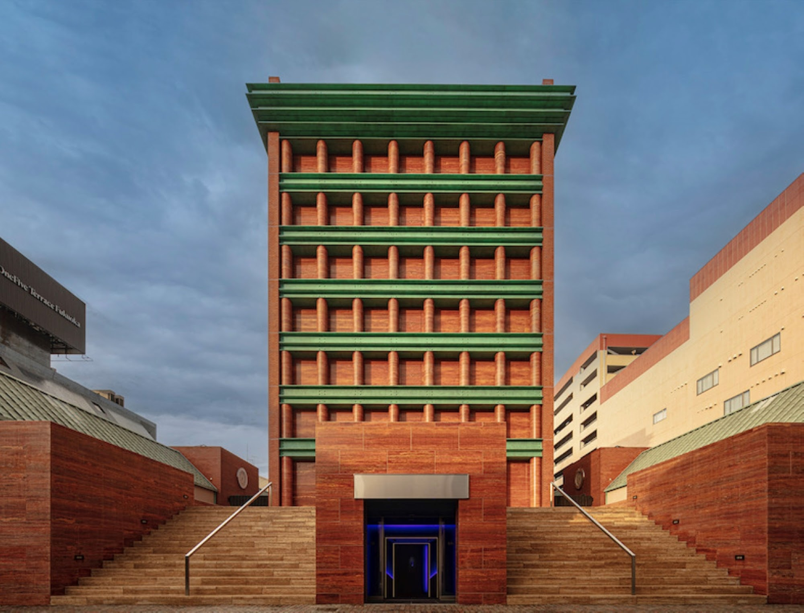

#### 其他
- 行政區：日本・福岡縣 福岡市 中央區 春吉（Haruyoshi）
- 交通：
  - 介於天神/中洲/運河城一帶，適合夜景街拍＋吃飯移動。
- 優先度：已訂/候選
- 其他連結：
  - 官網：https://ilpalazzo.jp/

### 其他
- 地址（Google Maps）：3 Chome-13-1 Haruyoshi, Chuo Ward, Fukuoka, 810-0003 日本
- Place ID（Google Maps ftid）：0x3541919420618f05:0x47941a11f2a411c4
---
# [美食] 麵屋兼虎 天神本店（Menya Kanetora）
> 座標: 33.587200, 130.401203
> 地址: 〒810-0004 福岡県福岡市中央区渡辺通４丁目９−１８ 福酒ビル 1F
> 連結: https://www.google.com/maps/place/%E9%BA%B5%E5%B1%8B%E5%85%BC%E8%99%8E+%E5%A4%A9%E7%A5%9E%E6%9C%AC%E5%BA%97/@33.5872002,130.401203,17z/data=!3m1!4b1!4m6!3m5!1s0x35419180a445b00f:0x166bb995858617e4!8m2!3d33.5872002!4d130.401203!16s%2Fg%2F11b5pj842n?hl=ja

### 想做什麼
- 吃「濃厚魚介豚骨」系的沾麵/拉麵（招牌走重口味路線）

### 備註
- 名店等級，尖峰通常需要排隊；建議避開 12:00–13:30、18:30–20:30。
- 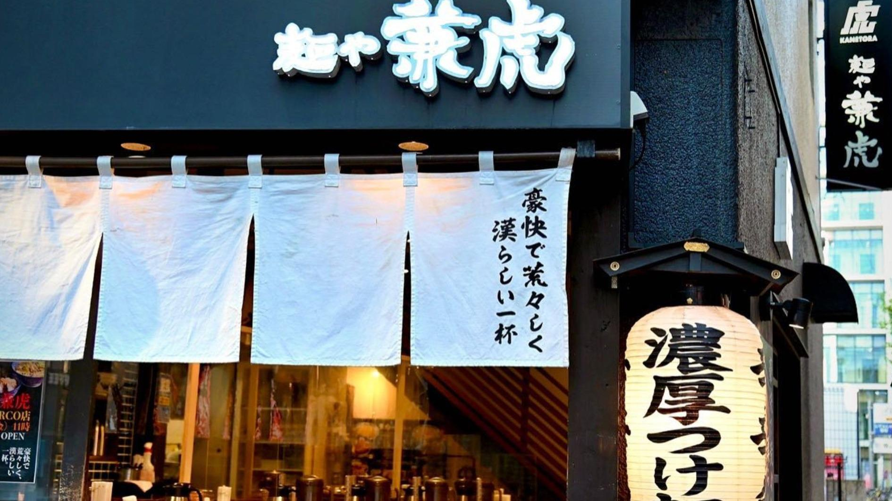

#### 其他
- 行政區：日本・福岡縣 福岡市 中央區 渡邊通 / 天神南一帶
- 優先度：想去
- 其他連結：
  - Place ID（Google Maps ftid）：0x35419180a445b00f:0x166bb995858617e4
  - 官網：https://www.kanetora.co.jp/
  - Tabelog：https://tabelog.com/tw/fukuoka/A4001/A400103/40035453/

### 其他
- 地址（Google Maps）：日本〒810-0004 Fukuoka, Chuo Ward, Watanabedori, 4 Chome−9−18 福酒ビル 1F
- 電話（Google Maps）：+81 92-726-6700
---
# [美食] かわ屋 祇園店（Kawaya Gion）
> 座標: 33.592653, 130.414766
> 地址: 〒812-0038 福岡県福岡市博多区祇園町２−８ Liens 祇園ビルディング
> 連結: https://www.google.com/maps/place/%E3%81%8B%E3%82%8F%E5%B1%8B+%E7%A5%87%E5%9C%92%E5%BA%97/@33.5926528,130.4147656,17z/data=!3m1!4b1!4m6!3m5!1s0x3541916cec893a6b:0x724a47c8c99660e3!8m2!3d33.5926528!4d130.4147656!16s%2Fg%2F11rhwjrmzq?hl=ja
> Day: 2

### 想做什麼
- 吃博多名物「かわ焼き」（烤雞皮串）＋串燒居酒屋氣氛

### 備註
- 你聽說要訂位：Tabelog 顯示「可預約」，建議直接用 Tabelog/電話/官網先訂；若臨時去，熱門時段可能需要排隊。
- 營業時間（官網可讀到）：17:00–25:00（L.O. 24:30）（以現場公告為準）。
- 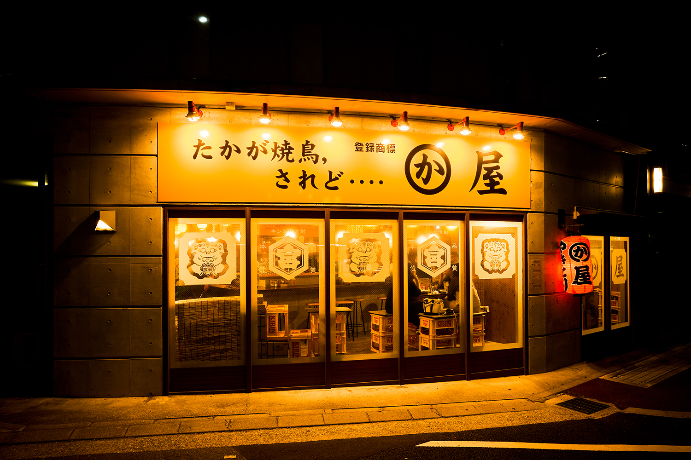

#### 其他
- 行政區：日本・福岡縣 福岡市 博多區 祇園（Gion）
- 優先度：想去
- 其他連結：
  - Place ID（Google Maps ftid）：0x3541916cec893a6b:0x724a47c8c99660e3
  - 官網：https://kawaya.orwst.com/gion
  - Tabelog：https://tabelog.com/tw/fukuoka/A4001/A400101/40059272/

### 其他
- 地址（Google Maps）：日本〒812-0038 Fukuoka, Hakata Ward, Gionmachi, 2−8 Liens 祇園ビルディング
- 電話（Google Maps）：+81 92-281-3100
---
# [美食] 中津からあげ専門店 吉吾 湯布院店（Nakathu fried chicken / Kichigo）
> 座標: 33.266951, 131.363412
> 地址: 〒879-5102 大分県由布市湯布院町川上１１００−８
> 連結: https://www.google.com/maps/place/Nakathu+fried+chicken/@33.2669511,131.3634117,17z/data=!3m1!4b1!4m6!3m5!1s0x3546af0b5f814f8b:0x91a2d77846736832!8m2!3d33.2669511!4d131.3634117!16s%2Fg%2F11n034fcdw?entry=ttu

### 想做什麼
- 吃唐揚炸雞（中津からあげ系）當湯布院逛街小吃
- 外帶邊走邊吃（也有內用座位）

### 備註
- Google Maps 顯示店名為「中津からあげ専門店 吉吾 湯布院店」。
- Google Maps 顯示：可內用、可外帶、無外送。
- 營業時間（Google Maps）：10:30 開始（以現場為準）。
- 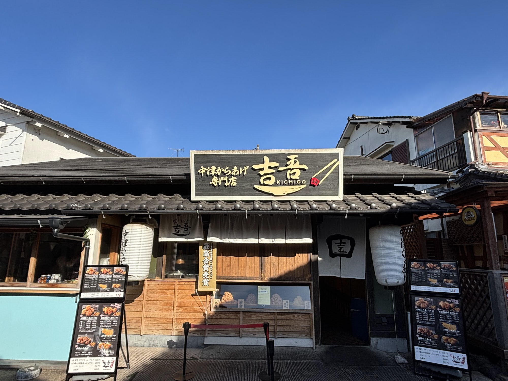

#### 其他
- 行政區：日本・大分縣 由布市 湯布院町（湯布院）
- 交通：
  - 湯布院商店街步行順路。
- 預估停留時間：15–30 分鐘（含排隊購買）
- 優先度：想去
- 其他連結：
  - 官網（分店頁；Google Maps 顯示）：https://www.kichigo.com/store/store_164/

### 其他
- 價位（Google Maps）：¥1–1,000 / 人
- 地址（Google Maps）：1100-8 Yufuincho Kawakami, Yufu, Oita 879-5102 日本
- 電話（Google Maps）：+81 977-84-5678
---
# [美食] 由布まぶし 心 金鱗湖本店（由布釜飯「心」/ Yufu Mabushi Shin）
> 座標: 33.267185, 131.367853
> 地址: 〒879-5102 大分県由布市湯布院町川上１４９２−１
> 連結: https://www.google.com/maps/place/%E7%94%B1%E5%B8%83%E9%87%9C%E9%A3%AF+%E3%80%8C%E5%BF%83%E3%80%8D%E9%87%91%E9%B1%97%E6%B9%96%E6%9C%AC%E5%BA%97/@33.2671853,131.3678529,17z/data=!3m1!4b1!4m6!3m5!1s0x3546ae7d915bb8ad:0x348a50a9acb2baad!8m2!3d33.2671853!4d131.3678529!16s%2Fg%2F11bwfkxw_c?entry=ttu

### 想做什麼
- 吃釜飯/まぶし（主打「三吃」：先原味、再加配料、最後做成茶泡飯風格）
- 湯布院（金鱗湖）一帶安排午餐

### 備註
- Google Maps 顯示：可內用、可外帶、無外送。
- 官網「アクセス」有寫：由布院站步行約 30 分（偏慢慢走＋逛街路線）。
- 官網公告：店休可能不定休；建議當天要去前先確認。
- 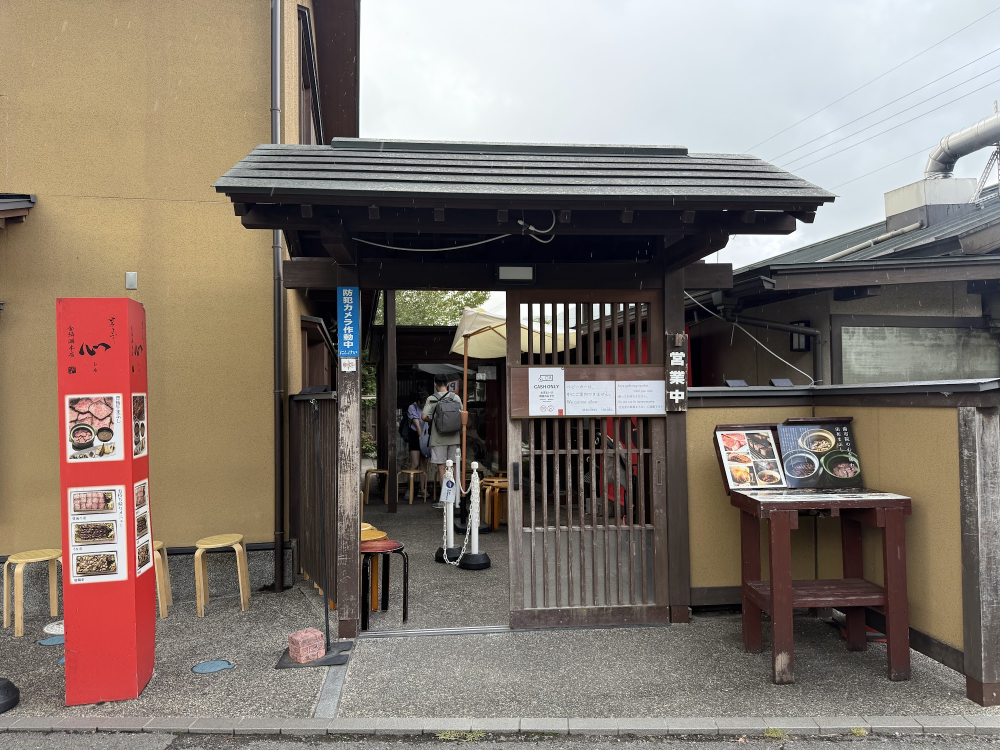

#### 其他
- 行政區：日本・大分縣 由布市 湯布院町（川上／金鱗湖一帶）
- 交通：
  - 由布院站出發一路逛湯之坪街道到金鱗湖順路。
- 預估停留時間：60–90 分鐘（含排隊）
- 優先度：想去
- 其他連結：
  - 官網（公式）：http://yufumabushi-shin.com/

### 其他
- 價位（Google Maps）：¥2,000–3,000 / 人
- 地址（Google Maps）：1492-1 Yufuincho Kawakami, Yufu, Oita 879-5102 日本
- 電話（Google Maps）：+81 977-85-7880
---
# [美食] 博多炉端 魚男（フィッシュマン）
> 座標: 33.5843858, 130.3995851
> 地址: 日本、〒810-0021 福岡県福岡市中央区今泉１丁目４−２３
> 連結: https://www.google.com/maps/place/%E5%8D%9A%E5%A4%9A%E7%82%89%E7%AB%AF+%E9%AD%9A%E7%94%B7+%EF%BC%88%E3%83%95%E3%82%A3%E3%83%83%E3%82%B7%E3%83%A5%E3%83%9E%E3%83%B3%EF%BC%89/@33.5843858,130.3995851,17z/data=!3m1!4b1!4m6!3m5!1s0x35419184bfae8e31:0x9880f28c4c804413!8m2!3d33.5843858!4d130.3995851!16s%2Fg%2F1tp0bfzg?hl=ja&entry=ttu

### 想做什麼
- 吃炉端燒＋海鮮／刺身（Google Maps 簡介提到有「階段狀木板盛刺身」的趣向套餐）
- 當作天神／今泉一帶晚餐或續攤的居酒屋選項
- 必點：海膽玉子燒／蟹味增／雞肉鴨肉丸／蟹肉／鮭魚斧飯／布丁

### 備註
- Google Maps 類別：居酒屋
- 
- 

#### 其他
- 行政區：日本・福岡県 福岡市中央区（今泉）
- 電話（Google Maps）：+81 80-4358-3875
- 其他連結：
  - Maps short link（你提供）：https://maps.app.goo.gl/Ux6rU3Jvd2oy7sdy6?g_st=ic
  - 食べログ：https://tabelog.com/fukuoka/A4001/A400104/40006960/
---
# [景點] 高千穂神社
> 座標: 32.7064465, 131.3020093
> 地址: 日本、〒882-1101 宮崎県西臼杵郡高千穂町三田井１０３７
> 連結: https://www.google.com/maps/place/%E9%AB%98%E5%8D%83%E7%A9%97%E7%A5%9E%E7%A4%BE/@32.7064465,131.2994344,17z/data=!3m1!4b1!4m6!3m5!1s0x35472ce8730bc035:0xbedd34618e78cbfa!8m2!3d32.7064465!4d131.3020093!16s%2Fm%2F0drxsvr?hl=ja&entry=ttu

### 想做什麼
- 看神話相關的能量景點
- 如果時間允許：搭配高千穂峡安排半日～一日

### 備註
- Google Maps 類別：神社
- Google Maps 簡介提到：可欣賞以神話為題材的舞踊（夜神楽相關）
- 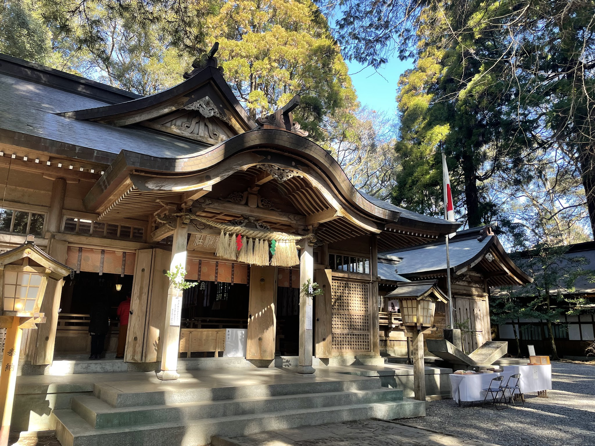

#### 其他
- 行政區：日本・宮崎県 西臼杵郡 高千穂町（三田井）
- 營業時間（Google Maps）：08:00 開始（以現場/公告為準）
- 電話（Google Maps）：+81 982-72-2413
- 其他連結：
  - Maps short link（你提供）：https://maps.app.goo.gl/mvuitMAqhZ4JXw8bA
  - X（Google Maps 網站欄位）：https://mobile.twitter.com/takachihojinja
---
# [景點] 高千穂峡（Takachiho Gorge）
> 座標: 32.703747, 131.300358
> 地址: 日本、〒882-1101 宮崎県西臼杵郡高千穂町三田井９８３
> 連結: https://www.google.com/maps/place/%E9%AB%98%E5%8D%83%E7%A9%82%E5%B3%A1/@32.7064465,131.2994344,17z/data=!4m6!3m5!1s0x35472d000a817703:0x8b953916ce12449e!8m2!3d32.703747!4d131.300358!16s%2Fg%2F11wh_2wntl?hl=ja&entry=ttu

### 想做什麼
- 看峽谷景觀、走步道
- 如果時間允許：安排划船（ボート）體驗

### 備註
- Google Maps 類別：景勝地
- Google Maps 顯示：24 小時開放（以現場/公告為準）
- 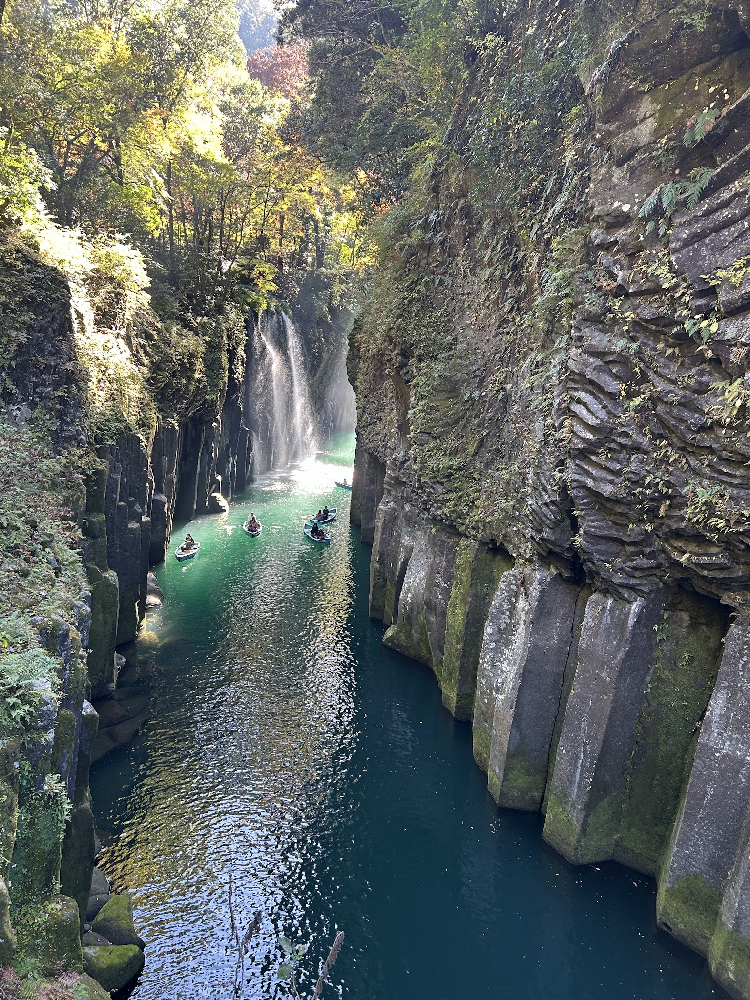

#### 其他
- 行政區：日本・宮崎県 西臼杵郡 高千穂町（三田井）
- 其他連結：
  - Maps short link（你提供）：https://maps.app.goo.gl/bQqZZk7xPoV4JHKy5
---
# [景點] 黒川温泉（黑川溫泉 / Kurokawa Onsen）
> 座標: 33.0780191, 131.1416136
> 地址: 日本、〒869-2402 熊本県阿蘇郡南小国町満願寺
> 連結: https://www.google.com/maps/place/%E6%97%A5%E6%9C%AC%E3%80%81%E3%80%92869-2402+%E7%86%8A%E6%9C%AC%E7%9C%8C%E9%98%BF%E8%98%87%E9%83%A1%E5%8D%97%E5%B0%8F%E5%9B%BD%E7%94%BA%E6%BA%80%E9%A1%98%E5%AF%BA+%E9%BB%92%E5%B7%9D%E6%B8%A9%E6%B3%89/@33.0743588,131.1403042,15z/data=!3m1!4b1!4m6!3m5!1s0x354130ea944142cd:0x4a9388f9ba71150!8m2!3d33.0780191!4d131.1416136!16s%2Fg%2F120rg0gs?hl=ja&entry=ttu

### 想做什麼
- 泡溫泉、住溫泉旅館
- 安排溫泉街散步

### 備註
- 這是一個溫泉區域點（不是單一旅館）；之後如果你有「想住哪一間」我可以再拆成獨立住宿條目。
- 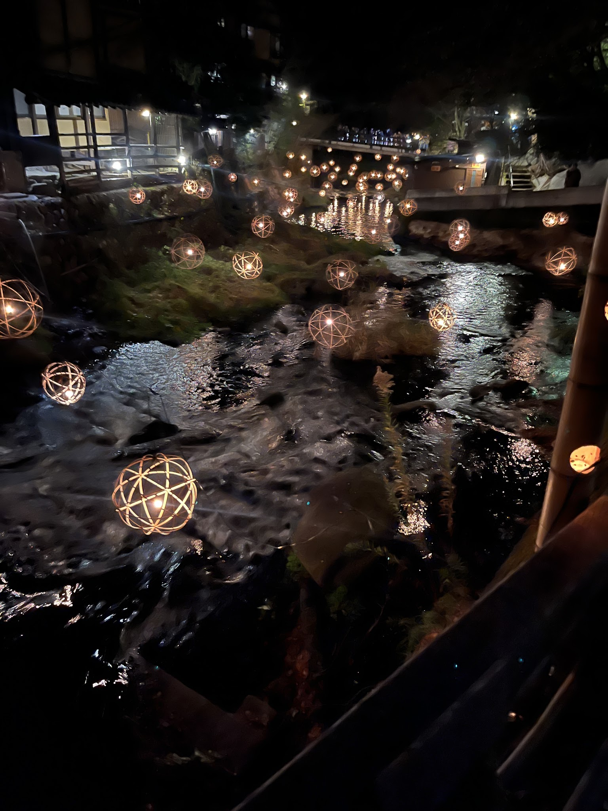

#### 其他
- 行政區：日本・熊本県 阿蘇郡 南小国町（満願寺）
- 其他連結：
  - Maps short link（你提供）：https://maps.app.goo.gl/ygiFr6T1x6aposX36
---
# [景點] 世界之塔（グローバルタワー / Global Tower）
> 座標: 33.2831944, 131.4861111
> 地址: 日本、〒874-0828 大分県別府市山の手町１２−１
> 連結: https://www.google.com/maps/place/%E3%82%B0%E3%83%AD%E3%83%BC%E3%83%90%E3%83%AB%E3%82%BF%E3%83%AF%E3%83%BC/@33.2831944,131.4861111,17z/data=!3m1!4b1!4m6!3m5!1s0x3546a6f72b653295:0x59691d21a5d08825!8m2!3d33.2831944!4d131.4861111!16s%2Fg%2F1tdwbr45?hl=ja&entry=ttu

### 想做什麼
- 上展望塔看別府市景／夜景

### 備註
- Google Maps 顯示所在施設：ビーコンプラザ
- 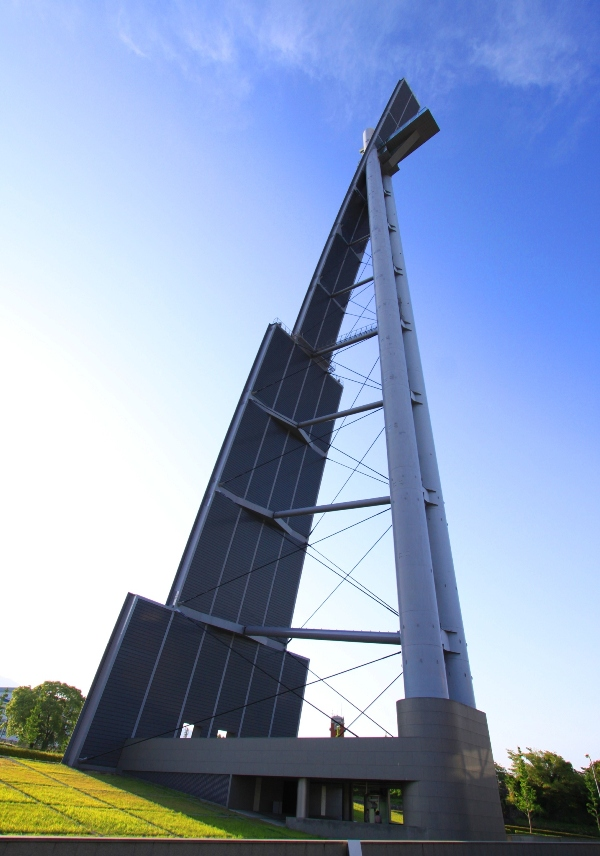

#### 其他
- 行政區：日本・大分県 別府市（山の手町）
- 營業時間（Google Maps）：09:00 開始（以現場/公告為準）
- 電話（Google Maps）：+81 977-26-7111
- Maps short link（你提供）：https://maps.app.goo.gl/EaWaUd4uAbff5PKHA
---
# [美食] 味蔵民芸茶屋（Aji Kura Mingei Jaya）
> 座標: 33.2987428, 131.4972382
> 地址: 日本、〒874-0919 大分県別府市石垣東６丁目７−３９
> 連結: https://www.google.com/maps/place/%E5%91%B3%E8%94%B5%E6%B0%91%E8%8A%B8%E8%8C%B6%E5%B1%8B/@33.2987428,131.4972382,17z/data=!3m1!4b1!4m6!3m5!1s0x3546a719ef48dd75:0x63237c479f169f2e!8m2!3d33.2987428!4d131.4972382!16s%2Fg%2F1tdz2mh8?hl=ja&entry=ttu

### 想做什麼
- 吃大分名物：とり天

### 備註
- Google Maps 簡介：木造古民家風的店，主打大分名物とり天；附白飯與味噌湯。
- 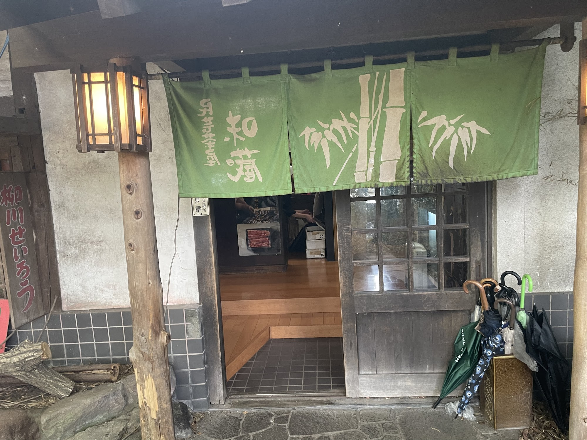

#### 其他
- 行政區：日本・大分県 別府市（石垣東）
- 營業時間（Google Maps）：10:30 開始（以現場/公告為準）
- 電話（Google Maps）：+81 977-21-0548
- 其他連結：
  - 官網：https://ajikura.info/
  - Maps short link（你提供）：https://maps.app.goo.gl/wgnw9R7tFNjVAXXeA
---
# [景點] 青島神社
> 座標: 31.804566, 131.4749474
> 地址: 日本、〒889-2162 宮崎県宮崎市青島２丁目１３−１
> 連結: https://www.google.com/maps/place/%E9%9D%92%E5%B3%B6%E7%A5%9E%E7%A4%BE/@31.804566,131.4749474,17z/data=!3m1!4b1!4m6!3m5!1s0x3538c7ac43aced4f:0x7f1161a9e99f85b0!8m2!3d31.804566!4d131.4749474!16s%2Fg%2F11fx7vv9vv?hl=ja&entry=ttu

### 想做什麼
- 去海邊小島上的神社參拜、拍照
- 順路看「鬼の洗濯板」海岸地形（如果你有要收我也可以再加一筆）

### 備註
- Google Maps 簡介：綠意很多的小島上的古風神社。
- 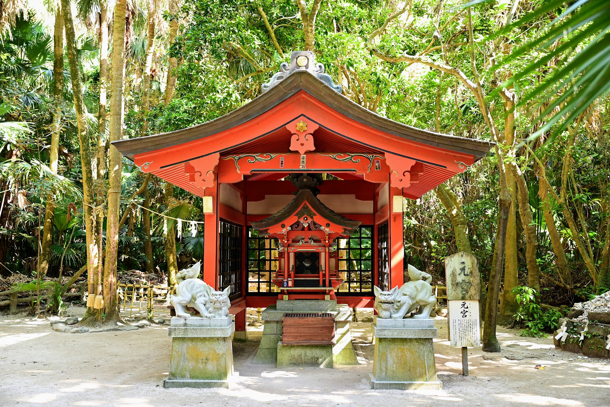

#### 其他
- 行政區：日本・宮崎県 宮崎市（青島）
- 營業時間（Google Maps）：08:00 開始（以現場/公告為準）
- 電話（Google Maps）：+81 985-65-1262
- 其他連結：
  - 官網：https://aoshima-jinja.jp/
  - Maps short link（你提供）：https://maps.app.goo.gl/4rBB9HvG9Nurxect7
---
# [景點] 鵜戸神宮（うどじんぐう / Udo Jingu）
> 座標: 31.6504477, 131.4666915
> 地址: 日本、〒887-0101 宮崎県日南市宮浦３２３２
> 連結: https://www.google.com/maps/place/%E9%B5%9C%E6%88%B8%E7%A5%9E%E5%AE%AE/@31.565155,131.4653128,12z/data=!4m6!3m5!1s0x3538da594b439fb1:0x8715e701f1b3cc1b!8m2!3d31.6504477!4d131.4666915!16s%2Fm%2F0ds879f?hl=ja&entry=ttu

### 想做什麼
- 去海岸洞窟裡的本殿參拜（超有特色）

### 備註
- Google Maps 簡介提到：洞窟內有本殿、可以投「運玉」祈願。
- 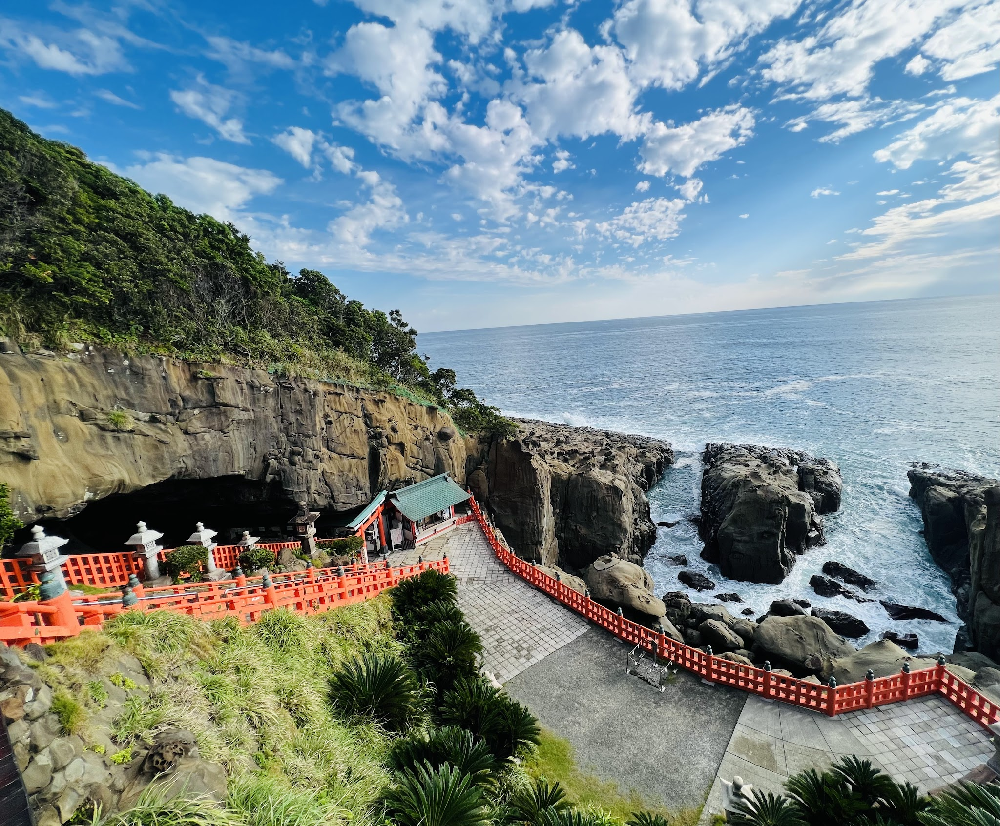

#### 其他
- 行政區：日本・宮崎県 日南市（宮浦）
- 營業時間（Google Maps）：06:00 開始（以現場/公告為準）
- 電話（Google Maps）：+81 987-29-1001
- 其他連結：
  - 官網：https://www.udojingu.or.jp/
  - Maps short link（你提供）：https://maps.app.goo.gl/SqRqJhyXX7xqvhiT9
---
# [住宿] AMANEK BEPPU YULA-RE（アマネク別府ゆらり）
> 座標: 33.2803116, 131.5026268
> 地址: 日本、〒874-0934 大分県別府市駅前本町６−３５
> 連結: https://www.google.com/maps/place/%E3%82%A2%E3%83%9E%E3%83%8D%E3%82%AF%E5%88%A5%E5%BA%9C%E3%82%86%E3%82%89%E3%82%8A/@33.2803004,131.5001258,17z/data=!4m9!3m8!1s0x3546a6dd129c0033:0x8b21d919495b5b62!5m2!4m1!1i2!8m2!3d33.2803116!4d131.5026268!16s%2Fg%2F11nn1c8hws?hl=ja&entry=ttu

### 想做什麼
- 住別府市區（站前一帶）
- 有大浴場：想泡湯放鬆

### 備註
- Google Maps 顯示：Check-in 15:00 / Check-out 11:00（以官方為準）
- 

#### 其他
- 行政區：日本・大分県 別府市（駅前本町）
- 電話（Google Maps）：+81 977-76-5566
- 其他連結：
  - 官網：https://amanekhotels.jp/beppu/
  - Maps short link（你提供）：https://maps.app.goo.gl/Nid2tqqkrhEWYS3x8
---
# [美食] LA ARADA（ラ・アラダ / 3 CEDARS COFFEE）
> 座標: 33.2788098, 131.5045597
> 地址: 日本、〒874-0920 大分県別府市北浜１丁目１０−１
> 連結: https://www.google.com/maps/place/LA+ARADA(3+CEDARS+COFFEE)+%E3%83%A9%E3%83%BB%E3%82%A2%E3%83%A9%E3%83%80(%E3%82%B9%E3%83%AA%E3%83%BC%E3%82%B7%E3%83%80%E3%83%BC%E3%82%BA%E3%82%B3%E3%83%BC%E3%83%92%E3%83%BC)/@33.5076606,131.4047872,10z/data=!4m7!3m6!1s0x3546a7000af3b359:0xd9a960171ac7c35f!8m2!3d33.2788098!4d131.5045597!15sCghMQSBBUkFEQVoKIghsYSBhcmFkYZIBC2NvZmZlZV9zaG9w4AEA!16s%2Fg%2F11xnmh3q6h?hl=ja

### 想做什麼
- 喝「冠軍咖啡」等級的咖啡（你標註）

### 備註
- Google Maps 類別：コーヒーショップ・喫茶店
- Google Maps 網站欄位指向 IG：3cedarscoffee
- 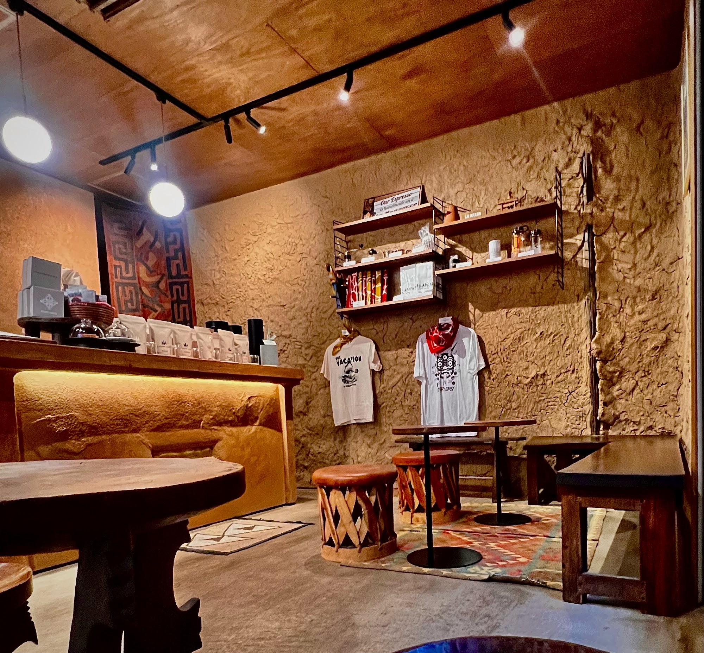

#### 其他
- 行政區：日本・大分県 別府市（北浜）
- 營業時間（Google Maps）：09:00 開始（以現場/公告為準）
- 其他連結：
  - IG（Google Maps 網站）：https://www.instagram.com/3cedarscoffee/
  - Maps short link（你提供）：https://maps.app.goo.gl/iQKkEhAugokBFYbi7
---
# [美食] 友永パン屋（Tomonaga Bakery）
> 座標: 33.2745879, 131.504148
> 地址: 日本、〒874-0942 大分県別府市千代町２−２９
> 連結: https://www.google.com/maps/place/%E5%8F%8B%E6%B0%B8%E3%83%91%E3%83%B3%E5%B1%8B/@33.2745879,131.504148,17z/data=!3m1!4b1!4m6!3m5!1s0x3546a6c3b67a8ff7:0x3feb11a15c177bc1!8m2!3d33.2745879!4d131.504148!16s%2Fg%2F1tg6shwq?hl=ja&entry=ttu

### 想做什麼
- 逛別府在地麵包店、買早餐/點心

### 備註
- Google Maps 網站欄位是 IG（之後你想補必買麵包我再加）
- 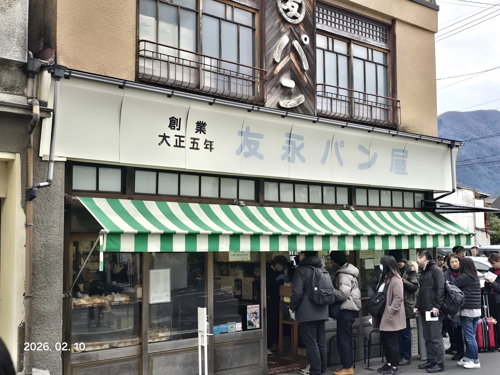

#### 其他
- 行政區：日本・大分県 別府市（千代町）
- 營業時間（Google Maps）：08:30 開始（以現場/公告為準）
- 電話（Google Maps）：+81 977-23-0969
- 其他連結：
  - IG（Google Maps 網站）：https://www.instagram.com/tomonagapan/
  - Maps short link（你提供）：https://maps.app.goo.gl/3kpW6iFGGNdtDgVWA
---
# [美食] CARNE 湯布院 串焼き
> 座標: 33.264856, 131.3563542
> 地址: 日本、〒879-5102 大分県由布市湯布院町川上３７２５−５
> 連結: https://www.google.com/maps/place/CARNE+%E6%B9%AF%E5%B8%83%E9%99%A2+%E4%B8%B2%E7%84%BC%E3%81%8D/@33.264856,131.3563542,17z/data=!3m1!4b1!4m6!3m5!1s0x3546add733e95555:0xc5f8592cae55a801!8m2!3d33.264856!4d131.3563542!16s%2Fg%2F11fslrvsy3?hl=ja&entry=ttu

### 想做什麼
- 吃串燒（湯布院晚餐候選）

### 備註
- Google Maps 網站欄位：Facebook
- 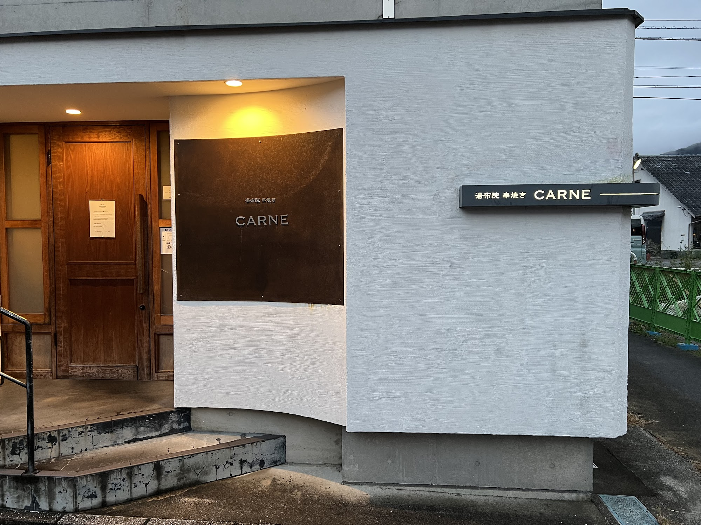

#### 其他
- 行政區：日本・大分県 由布市（湯布院町川上）
- 營業時間（Google Maps）：17:30 開始（以現場/公告為準）
- 電話（Google Maps）：+81 977-85-7540
- 其他連結：
  - Facebook（Google Maps 網站）：https://www.facebook.com/CARNE-583610288343781/
  - Maps short link（你提供）：https://maps.app.goo.gl/LbEpF1AorSb18gjE6
---
# [景點] 金鱗湖
> 座標: 33.2666644, 131.3690272
> 地址: 日本、〒879-5102 大分県由布市湯布院町川上１５６１−１
> 連結: https://www.google.com/maps/place/%E9%87%91%E9%B1%97%E6%B9%96/@33.2665421,131.3663526,17z/data=!4m6!3m5!1s0x3546ae7d9e05b46b:0x8e77ad60f3cd87e6!8m2!3d33.2666644!4d131.3690272!16s%2Fg%2F1239vfsr?hl=ja&entry=ttu

### 想做什麼
- 早上看湖面＋晨霧景（Google Maps 也特別提到「朝霧」）
- 湯布院散步路線的終點/折返點

### 備註
- Google Maps 類別：景勝地
- Google Maps 簡介：以朝霧聞名，南端有一座小神社。
- 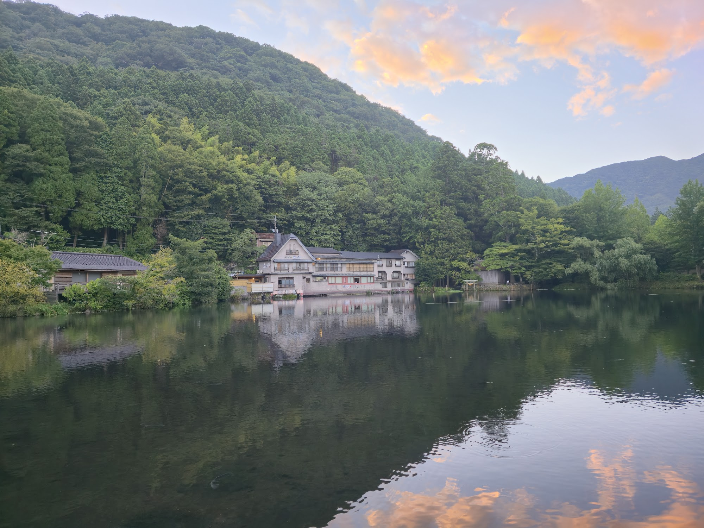

#### 其他
- 行政區：日本・大分県 由布市（湯布院町川上）
- 營業時間（Google Maps）：24 小時（以現場/公告為準）
- 其他連結：
  - 官網（由布市觀光）：https://www.city.yufu.oita.jp/kankou/kankou-2/kankou_cate1_1/kinrinko
  - Maps short link（你提供）：https://maps.app.goo.gl/bFhcBcu6GuBSQGvL8
---
# [住宿] 和モダンな温泉旅館 湯布院らんぷの宿
> 座標: 33.2657643, 131.3536508
> 地址: 日本、〒879-5102 大分県由布市湯布院町川上３６３９−１
> 連結: https://www.google.com/maps/place/%E5%92%8C%E3%83%A2%E3%83%80%E3%83%B3%E3%81%AA%E6%B8%A9%E6%B3%89%E6%97%85%E9%A4%A8+%E6%B9%AF%E5%B8%83%E9%99%A2%E3%82%89%E3%82%93%E3%81%B7%E3%81%AE%E5%AE%BF/@33.2657643,131.3536508,17z/data=!3m1!4b1!4m9!3m8!1s0x3546add0f59ccb6b:0x38aeb3081e7b1f42!5m2!4m1!1i2!8m2!3d33.2657643!4d131.3536508!16s%2Fg%2F11f61dn5sr?hl=ja&entry=ttu

### 想做什麼
- 住溫泉旅館（和モダン風）

### 備註
- Google Maps 顯示：Check-in 15:00 / Check-out 10:00（以官方為準）
- 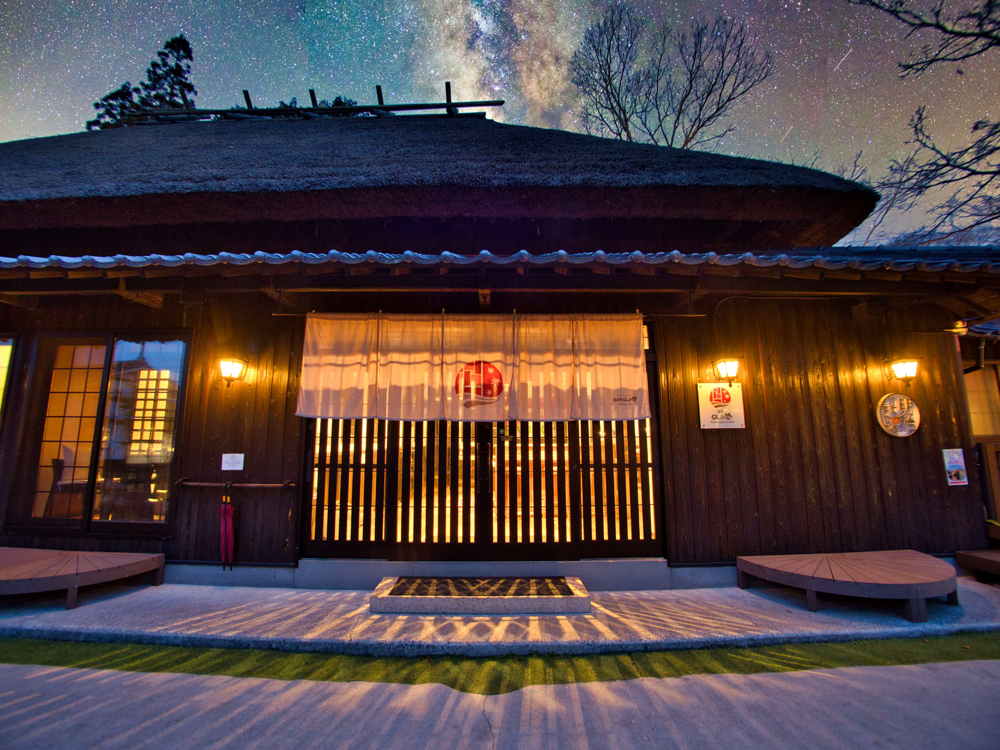

#### 其他
- 其他連結：
  - 官網：https://yufuin.site/
  - Maps short link（你提供）：https://maps.app.goo.gl/Tny1NktgRc3BQzza7
---
# [美食] 海鮮料理 和彩処おおがみ（おおがみ）
> 座標: 33.2786238, 131.5054798
> 地址: 日本、〒874-0920 大分県別府市北浜１丁目１２−２
> 連結: https://www.google.com/maps/place/%E3%81%8A%E3%81%8A%E3%81%8C%E3%81%BF/@33.2786238,131.5054798,17z/data=!3m1!4b1!4m6!3m5!1s0x3546a6dc97587213:0x7d35f41f0fc583c6!8m2!3d33.2786238!4d131.5054798!16s%2Fg%2F1pv0vf3_q?hl=ja&entry=ttu

### 想做什麼
- 吃頂級海鮮居酒屋／海鮮料理（你註記：日本最頂的海鮮居酒屋等級）

### 備註
- 你註記：價格偏高，但評價很頂。
- Google Maps 類別：和食店
- 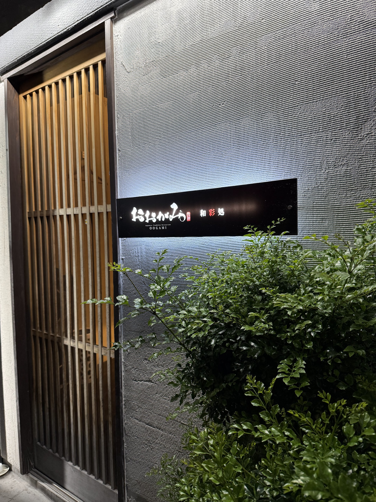

#### 其他
- 行政區：日本・大分県 別府市（北浜）
- 營業時間（Google Maps）：18:00 開始（以現場/公告為準）
- 電話（Google Maps）：+81 977-21-3553
- Maps short link（你提供）：https://maps.app.goo.gl/yUdJXEhn37fgHBM88
---
# [景點] 海神神社
> 座標: 33.0509896, 129.8378584
> 地址: 日本、〒859-3617 長崎県東彼杵郡川棚町三越郷
> 連結: https://www.google.com/maps/place/%E6%B5%B7%E7%A5%9E%E7%A5%9E%E7%A4%BE/@33.0509896,129.8378584,17z/data=!3m1!4b1!4m6!3m5!1s0x356aa2e7f04e1a17:0xe53269970af001eb!8m2!3d33.0509896!4d129.8378584!16s%2Fg%2F11cnbb07bb?hl=ja&entry=ttu

### 想做什麼
- 去海邊的神社參拜、拍照

### 備註
- Google Maps 類別：神社
- 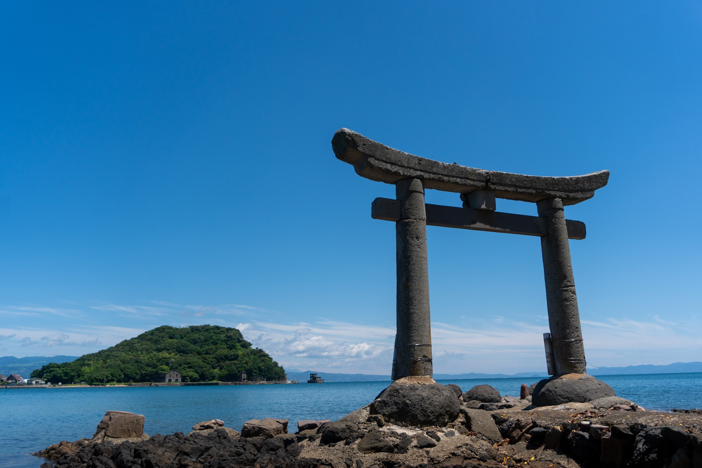

#### 其他
- 行政區：日本・長崎県 東彼杵郡 川棚町（三越郷）
- Maps short link（你提供）：https://maps.app.goo.gl/asaVEUbMka832SReA?g_st=ic
- Plus Code（Google Maps）：3R2Q+94 川棚町, 日本、長崎県
---
# [景點] 福岡タワー（福岡塔 / Fukuoka Tower）
> 座標: 33.5932846, 130.35151
> 地址: 日本、〒814-0001 福岡県福岡市早良区百道浜２丁目３−２６
> 連結: https://www.google.com/maps/place/%E7%A6%8F%E5%B2%A1%E3%82%BF%E3%83%AF%E3%83%BC/@33.5932846,130.35151,17z/data=!3m1!4b1!4m6!3m5!1s0x354193aa23040001:0xf9743b36617a912d!8m2!3d33.5932846!4d130.35151!16zL20vMDlzMXk4?hl=ja&entry=ttu

### 想做什麼
- 上展望台看福岡市景／博多灣
- 夜景／點燈時段（有時間可安排）

### 備註
- Google Maps 簡介：可一覽市區與博多灣；設有展望台、餐廳/ラウンジ。
- 
- 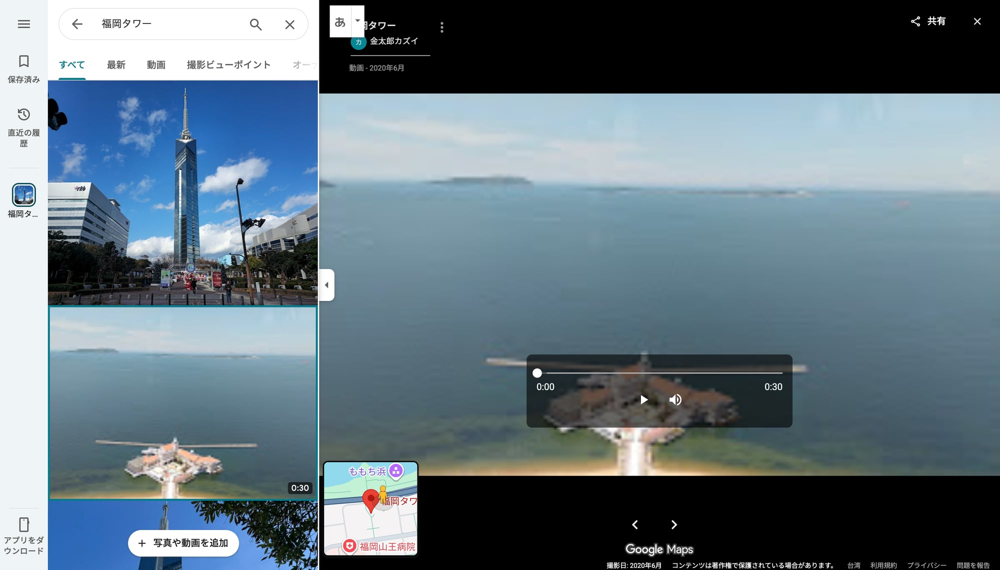

#### 其他
- 行政區：日本・福岡県 福岡市早良区（百道浜）
- 營業時間（Google Maps）：09:30 開始（以現場/公告為準）
- 電話（Google Maps）：+81 92-823-0234
- 其他連結：
  - 官網：https://www.fukuokatower.co.jp/
---
# [景點] 福岡城跡（福岡城 / Fukuoka Castle Ruins）
> 座標: 33.5852452, 130.3832159
> 地址: 日本、〒810-0043 福岡県福岡市中央区城内１−１
> 連結: https://www.google.com/maps/place/%E7%A6%8F%E5%B2%A1%E5%9F%8E%E8%B7%A1/@33.5852452,130.3832159,17z/data=!3m1!4b1!4m6!3m5!1s0x354193d32689fe43:0x5f7b1b1a747c028a!8m2!3d33.5852452!4d130.3832159!16s%2Fm%2F02z22hf?hl=ja&entry=ttu
> Day: 1

### 想做什麼
- 走舞鶴公園一帶，順路看福岡城遺跡／石垣
- 如果安排大濠公園：可一起串成半日散步

### 備註
- Google Maps 簡介：1600 年代城跡，部分石垣現存、位在視野不錯的丘上公園。
- 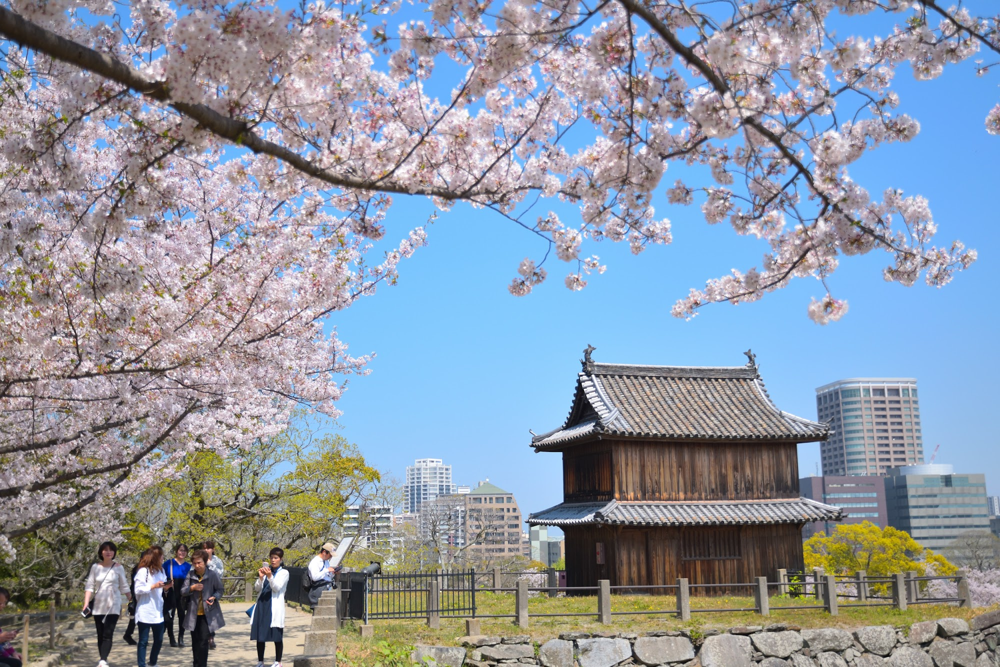

#### 其他
- 行政區：日本・福岡県 福岡市中央区（城内／舞鶴公園）
- 營業時間（Google Maps）：09:00 開始（以現場/公告為準）
- 電話（Google Maps）：+81 92-732-4801
- 其他連結：
  - 官網：https://fukuokajyo.com/
---
# [景點] 大濠公園（Ōhori Park / 大濠公園）
> 座標: 33.5898244, 130.3751317
> 地址: 日本、〒810-0051 福岡県福岡市中央区
> 連結: https://www.google.com/maps/place/%E6%97%A5%E6%9C%AC%E3%80%81%E3%80%92810-0051+%E7%A6%8F%E5%B2%A1%E7%9C%8C%E7%A6%8F%E5%B2%A1%E5%B8%82%E4%B8%AD%E5%A4%AE%E5%8C%BA%E5%A4%A7%E6%BF%A0%E5%85%AC%E5%9C%92/@33.5862703,130.3767465,16z/data=!3m1!4b1!4m6!3m5!1s0x354193ccebd1911f:0x483731aeac74e99f!8m2!3d33.5898244!4d130.3751317!16s%2Fg%2F1pxyttq1m?hl=ja&entry=ttu

### 想做什麼
- 大湖畔散步／慢跑（環湖步道）
- 當作市區放空點，順路可串福岡城跡

### 備註
- Google Maps 摘要：公園中心有大湖，周圍有慢跑/散步路線，還可租天鵝船；附近也有日本庭園與美術館等。
- 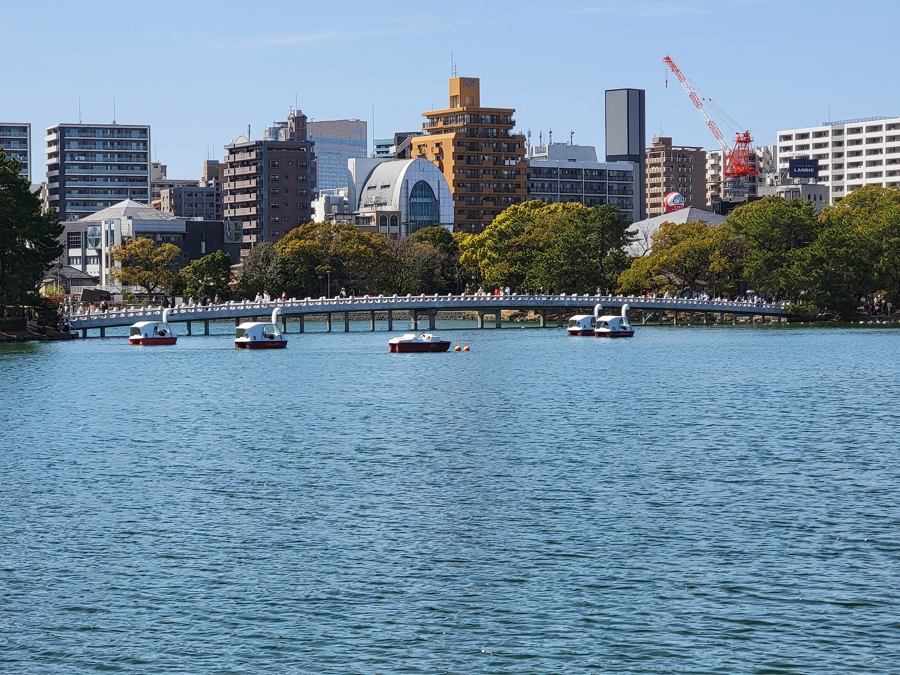

#### 其他
- 行政區：日本・福岡県 福岡市中央区
- 其他連結：
  - 你之後如果要補「日本庭園/美術館」我可以拆成獨立 POI
---
# [景點] 皿倉山展望台（皿倉山 / Sarakurayama Observation Deck）
> 座標: 33.8467326, 130.7968029
> 地址: 日本、〒805-0057 福岡県北九州市八幡東区尾倉１４８１−１ 2F
> 連結: https://www.google.com/maps/place/%E7%9A%BF%E5%80%89%E5%B1%B1%E5%B1%95%E6%9C%9B%E5%8F%B0/@33.8467326,130.7968029,17z/data=!3m1!4b1!4m6!3m5!1s0x3543c89de8324d25:0xd8bae0891403eb66!8m2!3d33.8467326!4d130.7968029!16s%2Fg%2F1tf9w68b?hl=ja&entry=ttu

### 想做什麼
- 看夜景（北九州代表性景點之一）
- 搭纜車/坡道車上山（時間安排可抓黃昏～入夜）

### 備註
- Google Maps 常見關鍵字：夜景、ケーブルカー（纜車）、山頂、展望台。
- 

#### 其他
- 行政區：日本・福岡県 北九州市八幡東区
- 電話（Google Maps）：+81 93-671-4761
- 其他連結：
  - 官網：http://www.sarakurayama-cablecar.co.jp/
---
# [景點] 川端通商店街（Kawabata-dori Shopping Arcade / 川端通商店街）
> 座標: 33.593537, 130.4083423
> 地址: 日本、〒812-0026 福岡県福岡市博多区上川端町６−１３５
> 連結: https://www.google.com/maps/place/%E5%B7%9D%E7%AB%AF%E9%80%9A%E5%95%86%E5%BA%97%E8%A1%97/@33.593537,130.4083423,17z/data=!3m1!4b1!4m6!3m5!1s0x354191eb4d562889:0x7cb17c65cc4038a8!8m2!3d33.593537!4d130.4083423!16s%2Fg%2F1232v3r2?hl=ja&entry=ttu

### 想做什麼
- 逛傳統商店街（有屋簷雨天也能逛）
- 找拉麵/小吃、買伴手禮（工藝品等）

### 備註
- Google Maps 簡介：アーケード商店街；有拉麵店、博多人形等工藝品店。
- 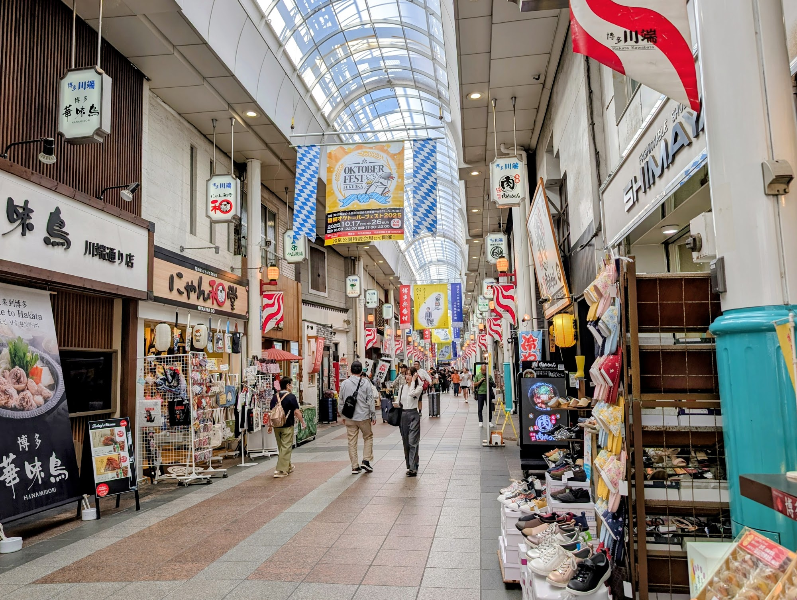

#### 其他
- 行政區：日本・福岡県 福岡市博多区（上川端町）
- 電話（Google Maps）：+81 92-281-6223
- 其他連結：
  - 官網：https://kawabatadori.com/
---
# [景點] 生ノ松原緑地（Ikinomatsubara Green Space / 生の松原）
> 座標: 33.5735171, 130.2990934
> 地址: 日本、〒819-0055 福岡県福岡市西区生の松原４丁目１２−１２
> 連結: https://www.google.com/maps/place/%E7%94%9F%E3%83%8E%E6%9D%BE%E5%8E%9F%E7%B7%91%E5%9C%B0/@33.5735171,130.2990934,17z/data=!3m1!4b1!4m6!3m5!1s0x3541eb8c3693225d:0xc023dc75e863a58e!8m2!3d33.5735171!4d130.2990934!16s%2Fg%2F11vc2g4l5j?hl=ja&entry=ttu

### 想做什麼
- 海邊松林散步（想看海、想放空的備選點）

### 備註
- Google Maps：標記為公園；可帶狗。
- 

#### 其他
- 行政區：日本・福岡県 福岡市西区（生の松原）
- 所在設施（Google Maps）：下山門西公園
---
# [景點] 太宰府表参道（太宰府天満宮 参道 / Dazaifu Omotesando）
> 座標: 33.5195648, 130.5319397
> 地址: 日本、〒818-0117 福岡県太宰府市宰府３丁目１
> 連結: https://www.google.com/maps/place/%E8%A1%A8%E5%8F%82%E9%81%93/@33.5195648,130.5271761,17z/data=!4m10!1m2!2m1!1z5aSq5a6w5bqcIOihqOWPgumBkw!3m6!1s0x35419ba28a8ae4e5:0xe3b7f28d87c41f62!8m2!3d33.5195648!4d130.5319397!15sChPlpKrlrrDlupwg6KGo5Y-C6YGTWhUiE-WkquWusOW6nCDooajlj4LpgZOSARJ0b3VyaXN0X2F0dHJhY3Rpb27gAQA!16s%2Fg%2F11f53gvlsl?hl=ja&entry=ttu
> Day: 3

### 想做什麼
- 逛太宰府天満宮前的參道商店街（小吃/伴手禮）
- 找梅ヶ枝餅（梅枝餅）

### 備註
- Google Maps：所在設施標記為「太宰府天満宮」。
- 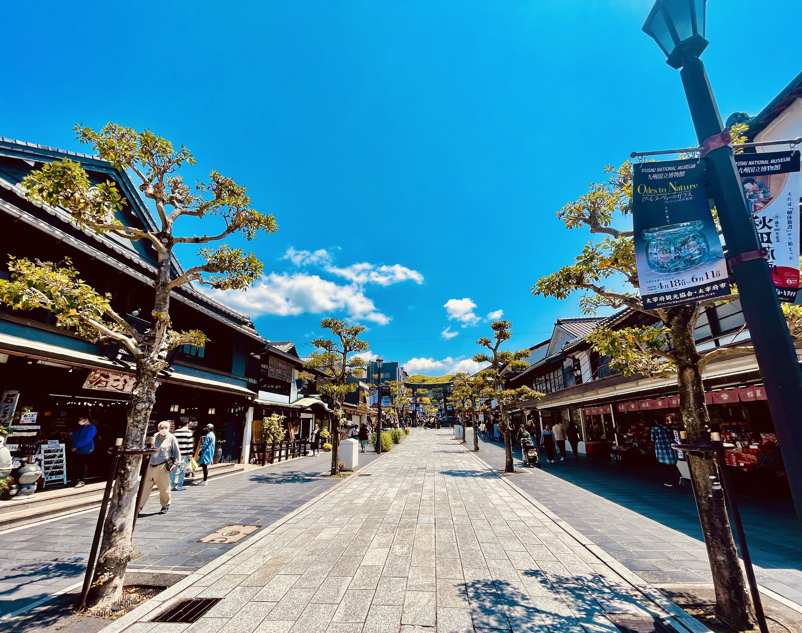

#### 其他
- 行政區：日本・福岡県 太宰府市（宰府）
- 之後若你想把「Starbucks 太宰府天満宮表参道店」等店家拆出來，我可以再補成獨立餐廳/咖啡 POI。
---
# [美食] 熊本ラーメン黒亭 下通店（Kokutei Shimotori / 黒亭）
> 座標: 32.8008669, 130.7081925
> 地址: 日本、〒860-0807 熊本県熊本市中央区下通１丁目７−１４ ノグチビル １階
> 連結: https://www.google.com/maps/place/%E7%86%8A%E6%9C%AC%E3%83%A9%E3%83%BC%E3%83%A1%E3%83%B3%E9%BB%92%E4%BA%AD+%E4%B8%8B%E9%80%9A%E5%BA%97/@32.8008669,130.6319748,13z/data=!3m1!5s0x3540f40d27e5106f:0xb27c288d82f88dbd!4m10!1m2!2m1!1z6buS5LqtIOeGiuacrA!3m6!1s0x3540f4097ec95555:0xbe9bb9834ecd00f5!8m2!3d32.8008669!4d130.7081925!15sCg3pu5Lkuq0g54aK5pysIgOIAQFaECIO6buSIOS6rSDnhormnKySARByYW1lbl9yZXN0YXVyYW504AEA!16s%2Fg%2F11dymvflhq?hl=ja&entry=ttu

### 想做什麼
- 吃熊本拉麵（下通商圈）

### 備註
- 你備註：黑亭拉麵（下通）。
- 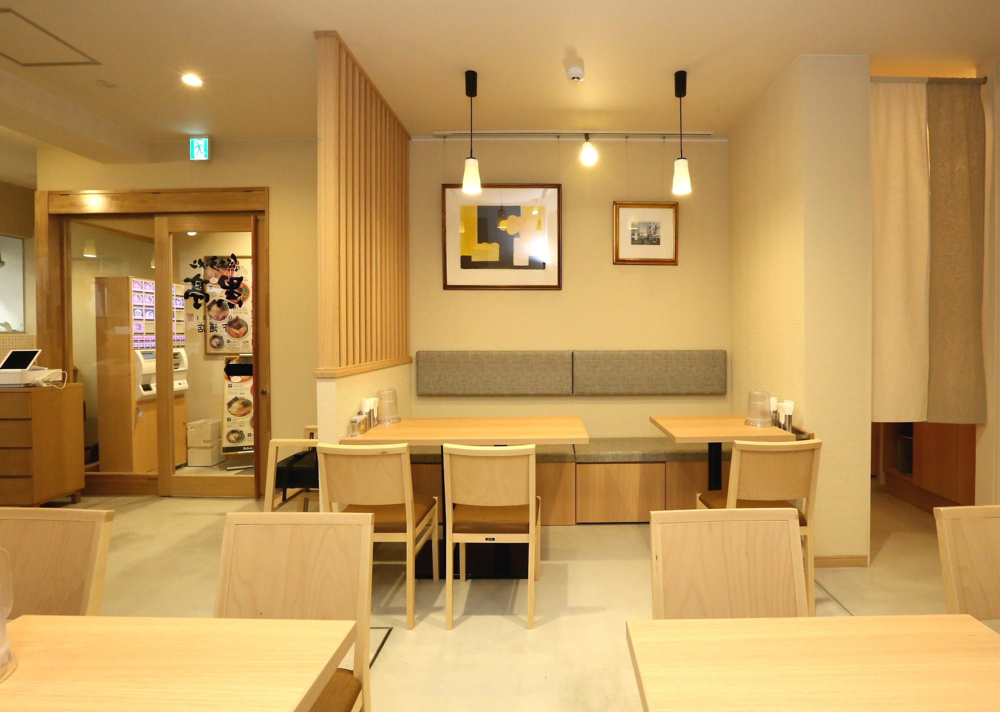

#### 其他
- 行政區：日本・熊本県 熊本市中央区（下通）
- 營業時間（Google Maps）：10:30 開始（以現場/公告為準）
- 電話（Google Maps）：+81 96-321-6202
- 其他連結：
  - 官網：https://www.kokutei.co.jp/
---
# [景點] くまモンスクエア（熊本熊廣場 / Kumamon Square）
> 座標: 32.8018121, 130.712455
> 地址: 日本、〒860-0808 熊本県熊本市中央区手取本町８−２ テトリアくまもとビル 1階
> 連結: https://www.google.com/maps/place/%E3%81%8F%E3%81%BE%E3%83%A2%E3%83%B3%E3%82%B9%E3%82%AF%E3%82%A8%E3%82%A2/@32.8018121,130.712455,17z/data=!3m1!4b1!4m6!3m5!1s0x3540f40bc0bb2bd3:0xea628ed1857bc9f4!8m2!3d32.8018121!4d130.712455!16s%2Fg%2F11b86mlt2w?hl=ja&entry=ttu

### 想做什麼
- 逛熊本熊官方相關展區/商店、買周邊

### 備註
- Google Maps：販售在地資訊、地方物產與食品等。
- 

#### 其他
- 行政區：日本・熊本県 熊本市中央区（手取本町）
- 營業時間（Google Maps）：10:00 開始（以現場/公告為準）
- 電話（Google Maps）：+81 96-327-9066
- 其他連結：
  - 官網：http://www.kumamon-sq.jp/
---
# [景點] 肥後よかモン市場（肥後Yokamon市場 / Higo Yokamon Ichiba）
> 座標: 32.7897582, 130.6882638
> 地址: 日本、〒860-0047 熊本県熊本市西区春日３丁目１５−３０
> 連結: https://www.google.com/maps/place/%E8%82%A5%E5%BE%8C%E3%82%88%E3%81%8B%E3%83%A2%E3%83%B3%E5%B8%82%E5%A0%B4/@32.7897582,130.6882638,17z/data=!3m1!4b1!4m6!3m5!1s0x3540f458db3863cf:0x5b4a5ecb1dbc79cc!8m2!3d32.7897582!4d130.6882638!16s%2Fg%2F1thmhs14?hl=ja&entry=ttu

### 想做什麼
- 熊本車站內/旁邊的土產+美食集中區（候車前後補給）

### 備註
- 你備註：肥後よかモン市場。
- 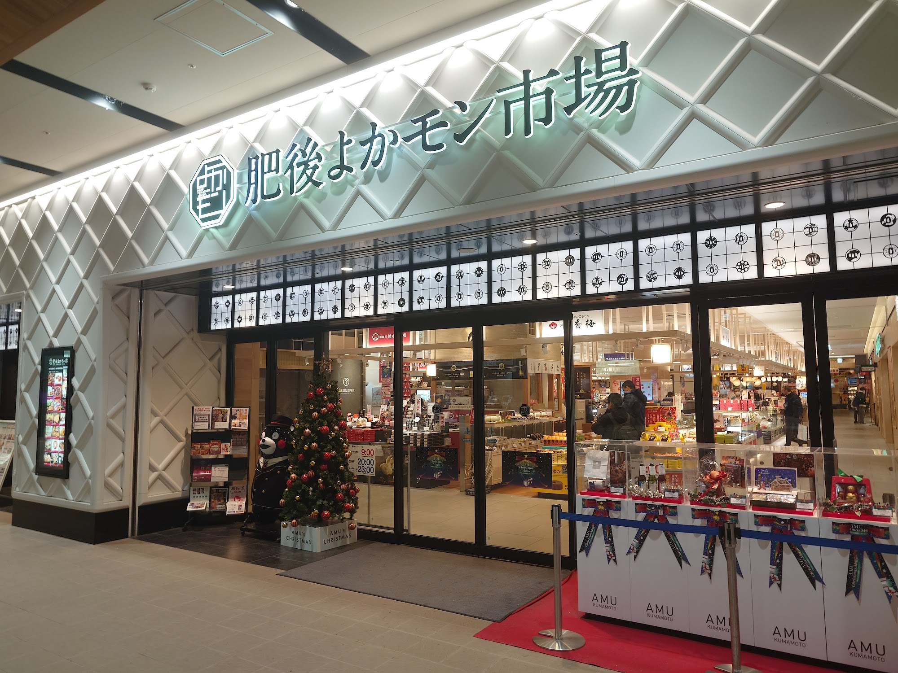

#### 其他
- 行政區：日本・熊本県 熊本市西区（熊本駅周邊）
- 營業時間（Google Maps）：10:00 開始（以現場/公告為準）
- 電話（Google Maps）：+81 96-206-2800
- 其他連結：
  - 參考：https://www.jrkumamotocity.com/amu
---
# [景點] 鶴屋百貨店（Tsuruya Department Store / 鶴屋百貨店）
> 座標: 32.8023422, 130.7111236
> 地址: 日本、〒860-0808 熊本県熊本市中央区手取本町６−１
> 連結: https://www.google.com/maps/place/%E9%B6%B4%E5%B1%8B%E7%99%BE%E8%B2%A8%E5%BA%97/@32.8023422,130.7111236,17z/data=!3m1!4b1!4m6!3m5!1s0x3540f40c72a3f5ef:0x1752936d949e910a!8m2!3d32.8023422!4d130.7111236!16s%2Fg%2F1tffrpyd?hl=ja&entry=ttu

### 想做什麼
- 逛百貨（你標記：鶴屋百貨、Wing）

### 備註
- Google Maps：可宅配。
- 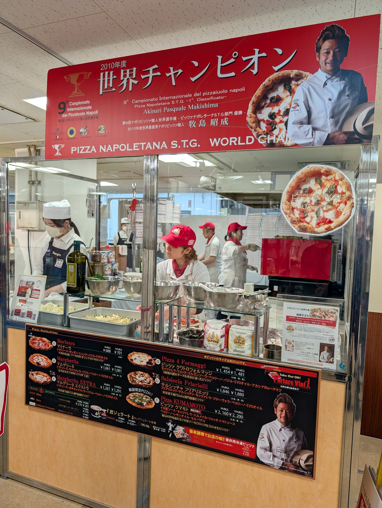

#### 其他
- 行政區：日本・熊本県 熊本市中央区（手取本町）
- 營業時間（Google Maps）：10:00 開始（以現場/公告為準）
- 電話（Google Maps）：+81 96-356-2111
- 其他連結：
  - 官網：http://www.tsuruya-dept.co.jp/
---
# [景點] 下通アーケード（下通商店街 / Shimotori Arcade）
> 座標: 32.8018853, 130.7089638
> 地址: 日本、〒860-0807 熊本県熊本市中央区下通１丁目３−１０
> 連結: https://www.google.com/maps/place/%E4%B8%8B%E9%80%9A%E3%82%A2%E3%83%BC%E3%82%B1%E3%83%BC%E3%83%89/@32.8018853,130.7089638,17z/data=!3m1!4b1!4m6!3m5!1s0x3540f40cf72b7ac1:0xe1e0ad9711ec4fd5!8m2!3d32.8018853!4d130.7089638!16s%2Fg%2F11df3dt2z0?hl=ja&entry=ttu

### 想做什麼
- 逛街（你標記：Wing、下通商店街）

### 備註
- Google Maps 摘要：全長約 511m 的拱廊街，約 175 間店鋪（店/咖啡）。
- 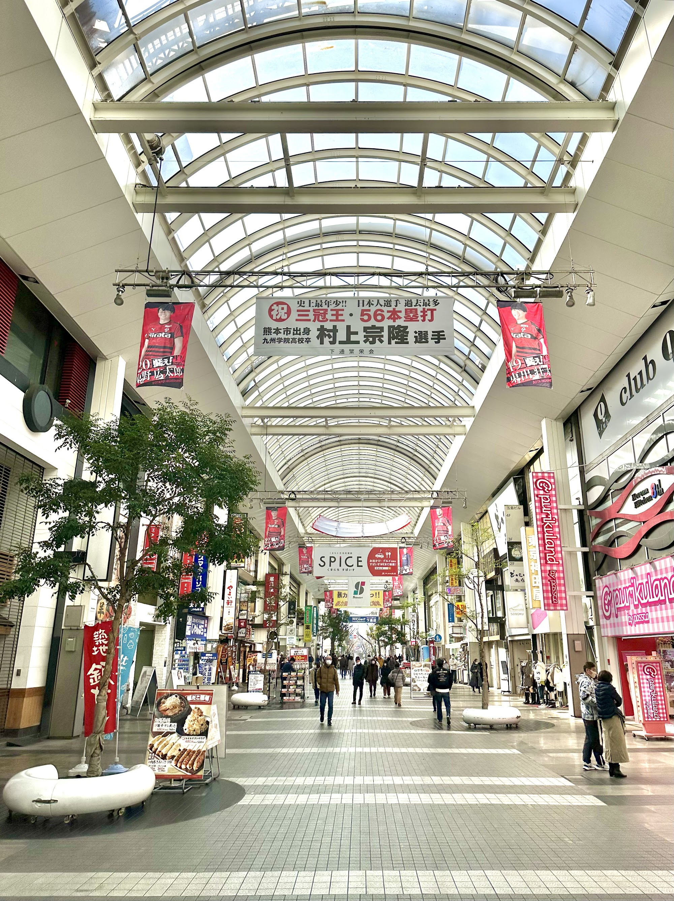

#### 其他
- 行政區：日本・熊本県 熊本市中央区（下通）
- 電話（Google Maps）：+81 96-352-3377
- 其他連結：
  - 官網：http://shimotoori.com/
---
# [美食] お茶の泉園 熊本城店（抹茶冰淇淋/焙茶拿鐵）
> 座標: 32.8035977, 130.703894
> 地址: 日本、〒860-0008 熊本県熊本市中央区二の丸１−１−２
> 連結: https://www.google.com/maps/place/%E3%81%8A%E8%8C%B6%E3%81%AE%E6%B3%89%E5%9C%92+%E7%86%8A%E6%9C%AC%E5%9F%8E%E5%BA%97/@32.8035977,130.703894,17z/data=!3m1!4b1!4m6!3m5!1s0x3540f412e2bfd7cb:0xc2464c7f9d6636a7!8m2!3d32.8035977!4d130.703894!16s%2Fg%2F12hrz_g6j?hl=ja&entry=ttu

### 想做什麼
- 你標記：冰淇淋、焙茶拿鐵

### 備註
- 所在設施（Google Maps）：桜の馬場 城彩苑。
- 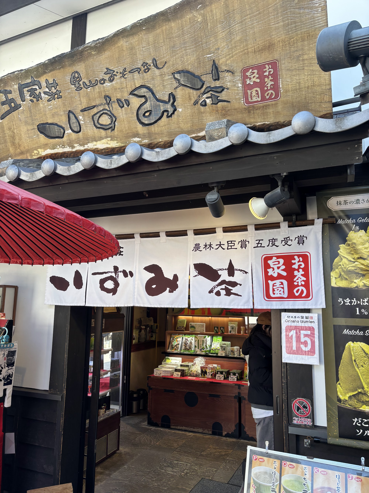

#### 其他
- 行政區：日本・熊本県 熊本市中央区（二の丸／熊本城周邊）
- 營業時間（Google Maps）：09:00 開始（以現場/公告為準）
- 電話（Google Maps）：+81 96-288-0015
- 其他連結：
  - 官網：http://ochanoizumien.jp/
---
# [美食] お菓子の香梅 熊本城香梅庵（陣太鼓冰淇淋）
> 座標: 32.8039288, 130.7037358
> 地址: 日本、〒860-0008 熊本県熊本市中央区二の丸１−１−２
> 連結: https://www.google.com/maps/place/%E3%81%8A%E8%8F%93%E5%AD%90%E3%81%AE%E9%A6%99%E6%A2%85+%E7%86%8A%E6%9C%AC%E5%9F%8E%E9%A6%99%E6%A2%85%E5%BA%B5/@32.8039288,130.7037358,17z/data=!3m1!4b1!4m6!3m5!1s0x3540f4134164da3b:0xcd72b8fffe8a68f3!8m2!3d32.8039288!4d130.7037358!16s%2Fg%2F1tgd9587?hl=ja&entry=ttu

### 想做什麼
- 你標記：陣太鼓冰淇淋（陣太鼓ソフト）

### 備註
- 所在設施（Google Maps）：桜の馬場 城彩苑。
- 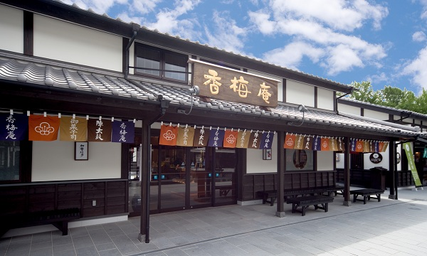

#### 其他
- 行政區：日本・熊本県 熊本市中央区（二の丸／熊本城周邊）
- 營業時間（Google Maps）：09:00 開始（以現場/公告為準）
- 電話（Google Maps）：+81 96-288-0039
- 其他連結：
  - 官網：https://kobai.jp/
---
# [景點] 桜井二見ヶ浦 夫婦岩（Sakurai Futamigaura / 夫婦岩）
> 座標: 33.640495, 130.1964802
> 地址: 日本、〒819-1304 福岡県糸島市志摩桜井
> 連結: https://www.google.com/maps/place/Sakurai+Futamigaura's+Couple+Stones/@33.640495,130.1917166,17z/data=!4m6!3m5!1s0x3541eedd30a39875:0x47f9acaa88434d66!8m2!3d33.640495!4d130.1964802!16s%2Fg%2F11bx56kb4k?entry=ttu
> Day: 2

### 想做什麼
- 拍海中白鳥居＋夫婦岩
- 看夕陽（想拍「夫婦岩之間落日」可注意季節/天氣/時間）

### 備註
- Google Maps 摘要：兩塊以注連繩相連的巨石（夫婦岩），可欣賞日落。
- 

#### 其他
- 行政區：日本・福岡県 糸島市（志摩桜井）
- 營業時間（Google Maps）：24 小時
- 電話（Google Maps）：+81 92-327-0317
- 其他連結：
  - https://sakuraijinja.com/futamigaura/
---
# [美食] 肉の山翔（Niku no Yamasho）
> 座標: 33.585964, 130.3956038
> 地址: 日本〒810-0041 福岡県福岡市中央区大名１丁目１−１７ 美和ビル 2F
> 連結: https://www.google.com/maps/place/Niku+no+Yamasho/@33.585964,130.3956038,17z/data=!3m1!4b1!4m6!3m5!1s0x3541911902895b63:0x34e2e451b9e16fd3!8m2!3d33.585964!4d130.3956038!16s%2Fg%2F11stzqjm3l?hl=ja&entry=ttu
> Day: 1

### 想做什麼
- 吃燒肉（看起來主打和牛 + 白飯/銀シャリ）
- 想嘗試：厚切牛舌（如果有）、套餐／飲料放題（以現場/官方為準）

### 備註
- IG 介紹：https://www.instagram.com/reel/DQZT1AeE7kE/?utm_source=ig_web_copy_link
- Google Maps 短連結：https://maps.app.goo.gl/UkRfhbfYxdEfYN8h9
- 

#### 其他
- 類型：日式燒肉
- 行政區：福岡・天神/大名
---
# [景點] 上色見熊野座神社（Kamishikimi Kumanoimasu Shrine）
> 座標: 32.853794, 131.158520
> 地址: 〒869-1601 熊本県阿蘇郡高森町上色見２６１９
> 連結: https://www.google.com/maps/place/%E4%B8%8A%E8%89%B2%E8%A6%8B%E7%86%8A%E9%87%8E%E5%BA%A7%E7%A5%9E%E7%A4%BE/@32.8537942,131.1497658,15z/data=!4m10!1m2!2m1!1z5LiK6Imy6KaL54aK6YeO5bqn56We56S-!3m6!1s0x3540d7ccee5ea361:0x75772fd6f78ac77e!8m2!3d32.8537942!4d131.1585205!15sChjkuIroibLopovnhorph47luqfnpZ7npL5aHyId5LiKIOiJsiDoposg54aK6YeOIOW6pyDnpZ7npL6SAQ1zaGludG9fc2hyaW5l4AEA!16s%2Fg%2F11gzqgzhl?hl=ja

### 想做什麼
- 參道拍照（石燈籠＋鳥居一路延伸的「異世界入口」感）
- 走到「穿戶岩／上色見穿戶岩（Ugeto-iwa）」巨岩洞
- 收御朱印（注意：御朱印可能需到高森站附近觀光處取得）

### 備註
- 以動畫《螢火之森》場景相似而知名；氣氛很像森林秘境。
- 主祭神：伊邪那岐命、伊邪那美命。
- 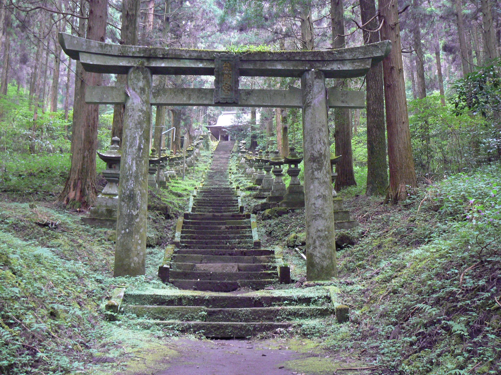

#### 其他
- 行政區：日本・熊本縣 阿蘇郡 高森町（你訊息寫福岡，但此景點實際在熊本阿蘇一帶）
- 預估停留時間：60–120 分鐘（拍照＋走到穿戶岩）
- 優先度：想去
- 其他連結：
  - IG（你提供）：https://www.instagram.com/reel/DIG2pFtzSyS/?igsh=dHpmbjFoMDN4Z3po
  - Wiki（中文）：https://zh.wikipedia.org/zh-tw/%E4%B8%8A%E8%89%B2%E8%A6%8B%E7%86%8A%E9%87%8E%E5%BA%A7%E7%A5%9E%E7%A4%BE
  - Wiki（EN）：https://en.wikipedia.org/wiki/Kamishikimi_Kumanoimasu_Shrine

### 其他
- 交通（先給一版粗略，之後你確定行程城市我再精煉）：
  - 建議自駕或包車較順（阿蘇/高森一帶大眾運輸相對不密）。
  - 若搭鐵道：可先到南阿蘇鐵道「高森站」一帶，再轉乘交通工具前往。
---
# [美食] 地獄蒸しプリン 岡本屋（岡本屋売店）
> 座標: 33.3180542, 131.4526114
> 地址: 日本、〒874-0840 大分県別府市明礬３組
> 連結: https://www.google.com/maps/place/%E5%B2%A1%E6%9C%AC%E5%B1%8B%E5%A3%B2%E5%BA%97/@33.3180542,131.4500365,17z/data=!3m1!4b1!4m6!3m5!1s0x3546a7c568807701:0xcf09508c83842569!8m2!3d33.3180542!4d131.4526114!16s%2Fg%2F11b74680ww?hl=ja&entry=ttu

### 想做什麼
- 吃「地獄蒸しプリン」（地獄蒸布丁）

### 備註
- Google Maps 類別：カフェ・喫茶
- 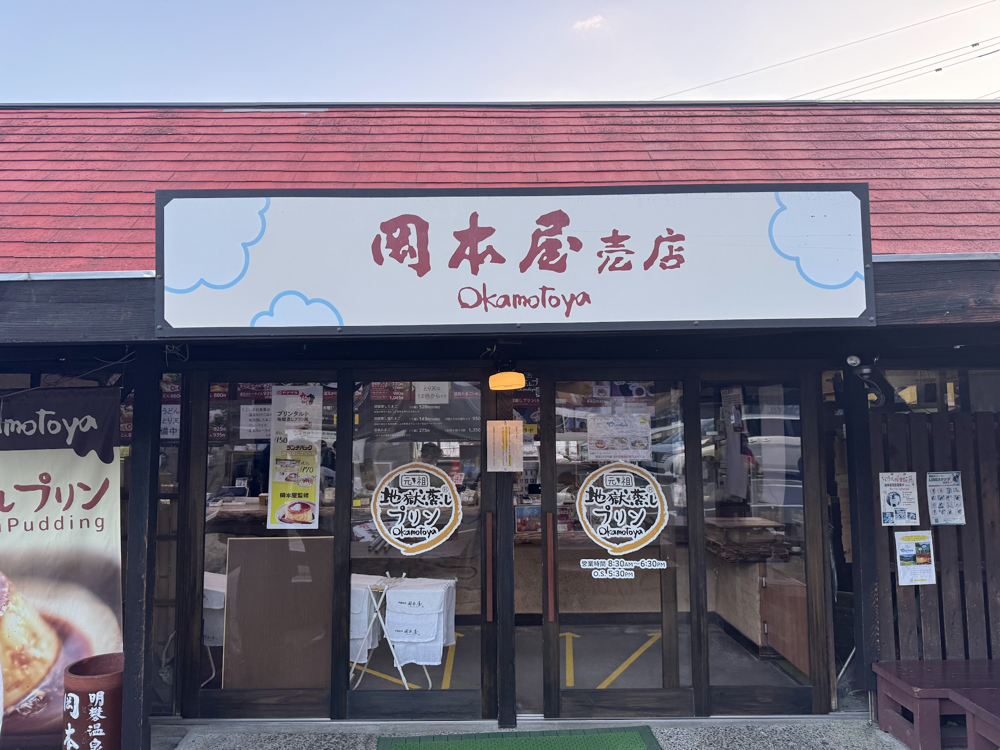

#### 其他
- 行政區：日本・大分県 別府市（明礬）
- 營業時間（Google Maps）：08:30 開始（以現場/公告為準）
- 電話（Google Maps）：+81 977-66-6115
- 其他連結：
  - 官網：http://www.jigoku-prin.com/
---
# [美食] 菅乃屋（桜の馬場 城彩苑 / Suganoya）
> 座標: 32.803558, 130.7037866
> 地址: 日本、〒860-0008 熊本県熊本市中央区二の丸１−１−２
> 連結: https://www.google.com/maps/place/%E8%8F%85%E4%B9%83%E5%B1%8B/@32.803558,130.7037866,17z/data=!3m1!4b1!4m6!3m5!1s0x3540f414a420cce5:0x462635b6579359ee!8m2!3d32.803558!4d130.7037866!16s%2Fg%2F11bccmm62b?hl=ja&entry=ttu

### 想做什麼
- 吃/買馬肉相關（你標記：馬肉可樂餅）

### 備註
- 所在設施（Google Maps）：桜の馬場 城彩苑。
- 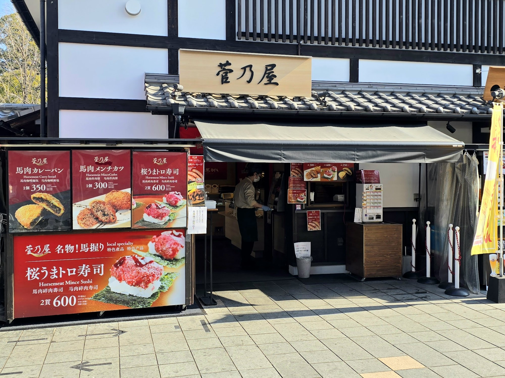

#### 其他
- 行政區：日本・熊本県 熊本市中央区（二の丸／熊本城周邊）
- 營業時間（Google Maps）：09:00 開始（以現場/公告為準）
- 電話（Google Maps）：+81 96-312-0377
- 其他連結：
  - 店鋪資訊：https://service.suganoya.com/shop/
---
# [美食] 麺屋我ガ 天神店（麵屋Gaga / Menya Gaga）
> 座標: 33.5856391, 130.3966811
> 地址: 日本〒810-0021 福岡県福岡市中央区今泉２丁目５−６ 1Ｆ-B
> 連結: https://www.google.com/maps/place/%E9%BA%B5%E5%B1%8BGaga+%E5%A4%A9%E7%A5%9E%E5%BA%97/@33.5856391,130.3966811,17z/data=!4m6!3m5!1s0x3541913c39a2a60f:0x78e51c59155ca46d!8m2!3d33.5856391!4d130.3966811!16s%2Fg%2F11s658w3c9?hl=ja&entry=ttu

### 想做什麼
- 吃拉麵（人均約 ¥1,000–2,000）

#### 其他
---
# [景點] 櫛田神社（Kushida Shrine）
> 座標: 33.5929546, 130.4104589
> 地址: 1-41 Kamikawabatamachi, Hakata Ward, Fukuoka, 812-0026 日本
> 連結: Google Maps：https://www.google.com/maps/place/%E6%AB%9B%E7%94%B0%E7%A5%9E%E7%A4%BE/@33.5929546,130.4104589,17z/data=!3m1!4b1!4m6!3m5!1s0x354191eaaa536a57:0xa1896c7e84458da4!8m2!3d33.5929546!4d130.4104589!16s%2Fm%2F0ds2_4l?hl=ja&entry=ttu
> Day: 3

### 想做什麼
- 逛博多總鎮守（博多祇園山笠相關）

### 備註
- Google Maps 短連結：https://maps.app.goo.gl/qTE1cwKHYvM8YoHv7
- 指定照片來源：https://www.google.com/maps/place/%E6%AB%9B%E7%94%B0%E7%A5%9E%E7%A4%BE/@33.5929546,130.4104589,3a,75y,90t/data=!3m8!1e2!3m6!1sCIHM0ogKEICAgICZ_Jm3Ww!2e10!3e12!6shttps:%2F%2Flh3.googleusercontent.com%2Fgps-cs-s%2FAHVAwepEMtqNfvyfeeUVM9ZJuzr0N5joJ-I9z3Idc2Uxm5s4Fm6yIr6TJk38zknBVO38bDOj09WZqEp93RUtzXkBwc_r8gAwJkt43Gr1iAWhntYH2KZVWuTSXgbEh0FyaRwrih9fQjg%3Dw203-h152-k-no!7i4032!8i3024!4m7!3m6!1s0x354191eaaa536a57:0xa1896c7e84458da4!8m2!3d33.5929546!4d130.4104589!10e5!16s%2Fm%2F0ds2_4l!18m1!1e1?entry=ttu
- 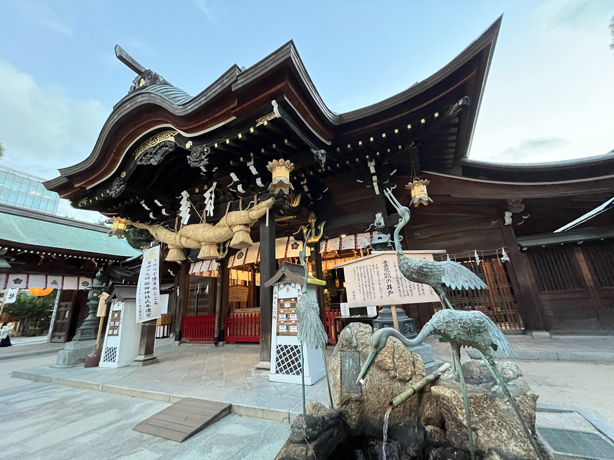

#### 其他
